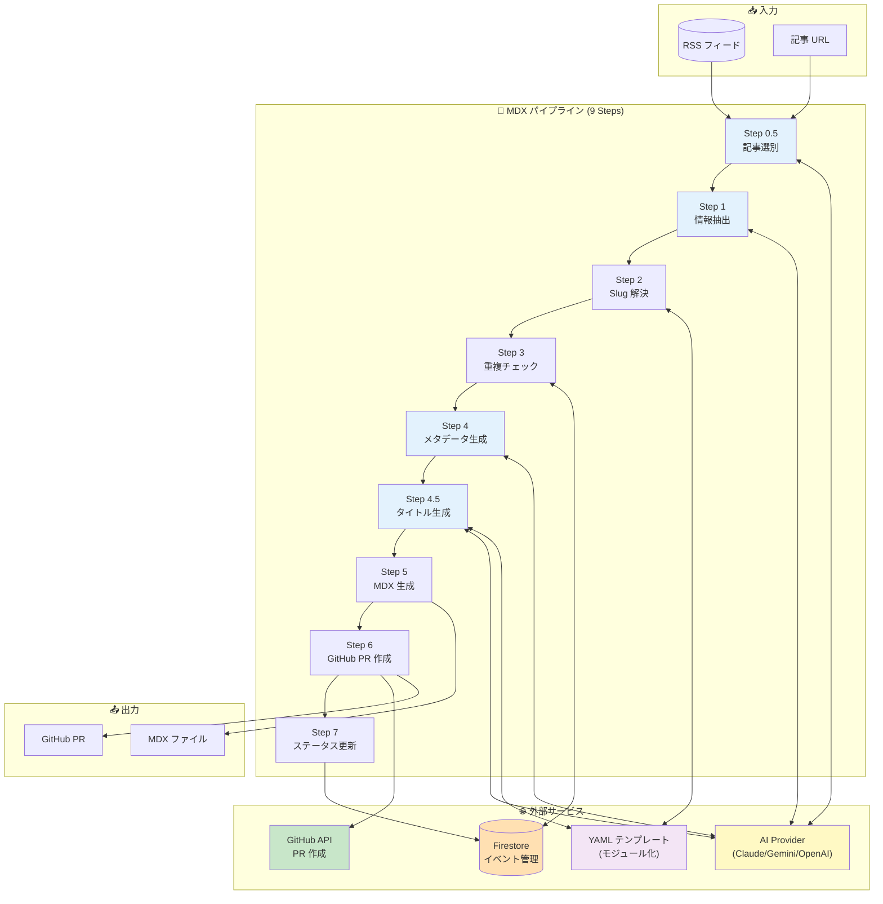
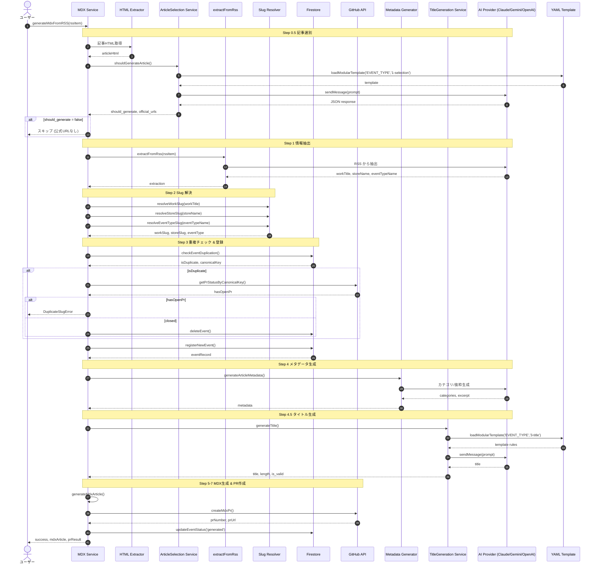
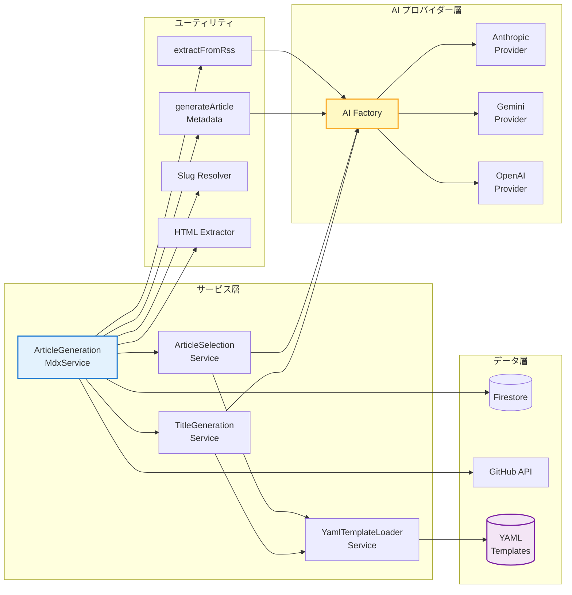
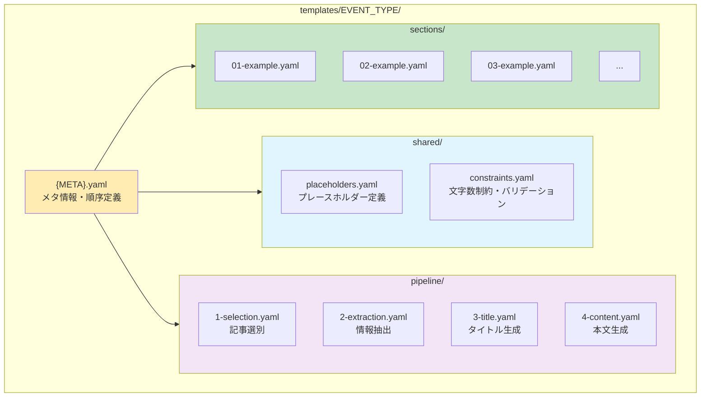
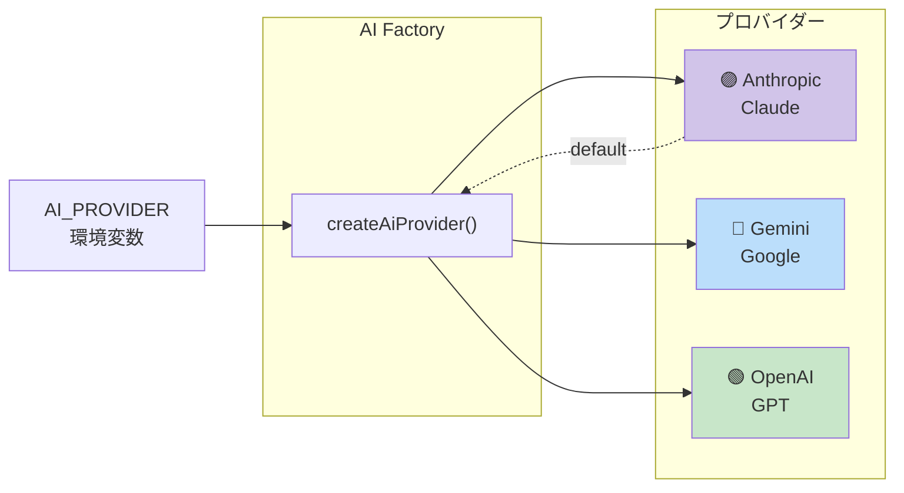
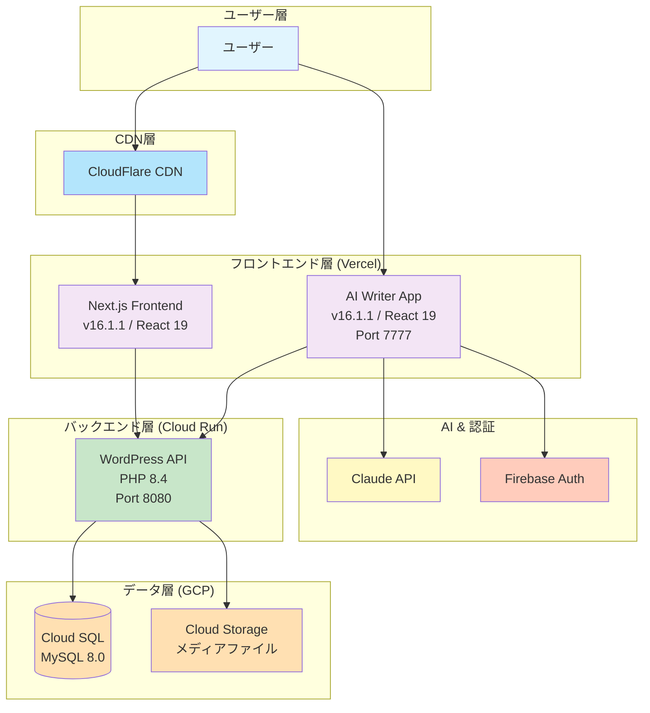
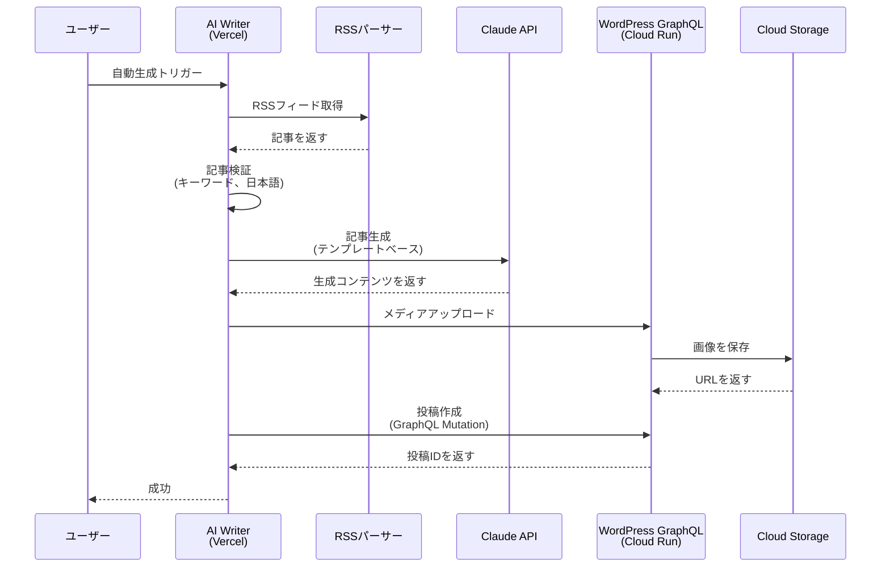
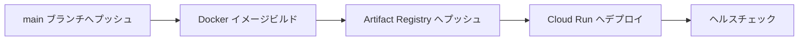

# Revolution

> **Languages**: [🇯🇵 日本語](README.md) | [🇬🇧 English](README.en.md)


---

## 📑 目次

- [概要](#-概要)
- [主要機能](#-主要機能)
- [クイックスタート](#-クイックスタート)
- [技術スタック](#️-技術スタック)
- [プロジェクト構造](#-プロジェクト構造)
- [アップデート情報](#-アップデート情報)
- [開発](#-開発)
- [デプロイ](#-デプロイ)
- [アーキテクチャ](#️-アーキテクチャ)
- [謝辞](#-謝辞)

---

## 📖 概要

**Revolution**は、[@thanks2music](https://github.com/thanks2music)が個人開発で取り組む、LLMを活用したAI記事生成機能を備えた Jamstack構成の次世代Webメディアシステムです。
これまで手動で1万記事以上を作成してきた経験をもとに、その知見をAIと組み合わせることで、記事制作から公開までを自動化するモダンな Web アプリケーションの構築に挑戦しています。

---

## ✨ 主要機能

### MDX ベース記事生成システム（現行版）

- 🤖 **AI 記事生成パイプライン**: RSS/URL → Nステップパイプライン → MDX ファイル → GitHub PR
- 🔄 **マルチ AI プロバイダー**: 環境変数で切り替え可能
  - Claude (Anthropic) - デフォルト
  - Gemini (Google)
  - OpenAI (GPT)

- 📝 **YAML テンプレートシステム**: [@thanks2music](https://github.com/thanks2music)の暗黙知をモジュール化したYAMLでプロンプト管理
- ⚡ **静的サイト生成（SSG）最適化**:
  - MDX による DBレス アーキテクチャ
  - `article-index.json` による高速記事検索
  - Vercel へのシームレスなデプロイ

- 🔐 **セキュア認証**: Firebase Authentication + カスタムクレーム
- 🧪 **テストカバレッジ**: Jest + Firebase Emulator による包括的テスト
- 📊 **モノレポ管理**: pnpm + Turbo による効率的なワークスペース管理

---

## 🚀 クイックスタート

### 前提条件

- **Node.js**: 22.0.0以上
- **pnpm**: 10.0.0以上
- **Google Cloud SDK**: Cloud Runデプロイ用（オプション）

### インストール

```bash
# リポジトリのクローン
git clone https://github.com/yourusername/revolution.git
cd revolution

# 依存関係のインストール
pnpm install

# 環境変数の設定
cp apps/ai-writer/.env.sample apps/ai-writer/.env.local
cp apps/frontend/.env.sample apps/frontend/.env.local

# 開発環境の起動（全ワークスペース）
pnpm dev
```

### 主要な環境変数

#### AI Writer (`apps/ai-writer/.env.local`)

```bash
# Firebase設定
NEXT_PUBLIC_FIREBASE_API_KEY=your_api_key
NEXT_PUBLIC_FIREBASE_PROJECT_ID=your_project_id
NEXT_PUBLIC_FIREBASE_AUTH_DOMAIN=your_project.firebaseapp.com

# Anthropic API
ANTHROPIC_API_KEY=your_anthropic_api_key
```

#### Frontend (`apps/frontend/.env.local`)

```bash
# 画像最適化
ALLOWED_IMAGE_HOST=localhost
```

詳細は各ワークスペースの `.env.sample` を参照してください。

---

## 🛠️ 技術スタック

### フロントエンドアプリケーション

| コンポーネント | 技術 | バージョン | 用途 |
|-----------|-----------|----------|---------|
| **メインフロントエンド** | Next.js / React / TypeScript | 16.1.1 / 19 / 5 | 公開Webサイト |
| **AI Writer** | Next.js / React / TypeScript | 16.1.1 / 19 / 5 | コンテンツ生成管理画面 |
| **スタイリング** | Tailwind CSS | Latest | UIデザイン |
| **状態管理** | SWR | 2.2+ | データフェッチング |

### バックエンド & インフラストラクチャ

| コンポーネント | 技術 | 詳細 |
|-----------|-----------|---------|
| **コンテナ** | Docker / Cloud Run | マルチステージビルド |
| **認証** | Firebase Authentication | 認可用カスタムクレーム |
| **CDN** | CloudFlare | 静的アセット配信 |

### 生成AI & 統合 & 自動化

| サービス | 用途 | パッケージ |
|---------|---------|---------|
| **Claude API** | 記事生成 | `@anthropic-ai/sdk` |
| **ChatGPT API** | 記事生成 | `@modelcontextprotocol/sdk` |
| **Gemini API** | 記事生成 | `@google/genai` |
| **Grok API** |  | `TRD` |
| **RSS Parser** | フィード収集 | `rss-parser` |
| **Article Extractor** | URLコンテンツ抽出 | `@extractus/article-extractor` |

### 開発ツール

| ツール | バージョン | 用途 |
|------|---------|---------|
| **pnpm** | 10.11.0+ | 高速パッケージマネージャー |
| **Turbo** | 2.5+ | モノレポビルドシステム |
| **Jest** | 30.2+ | ユニットテスト |
| **Firebase Emulator** | Latest | ローカル認証/DBテスト |
| **ESLint + Prettier** | Latest | コード品質 |

### LLM CLI

| ツール | バージョン | 開発元 |
|------|---------|---------|
| **Claude Code** | Latest | Anthropic |
| **Codex** | Latest | OpenAI |
| **Gemini CLI** | Latest | Google |
| **MCP Server Tools** | Latest | Various |

---

## 📁 プロジェクト構造

```
revolution/
├── apps/
│   ├── ai-writer/              # AIコンテンツ生成管理アプリ (Next.js 16.1.1 / React 19)
│   ├── frontend/               # メインNext.js Webサイト (Next.js 16.1.1 / React 19)
│   └── mcp-gcp-server/         # Model Context Protocolサーバー
│
├── docs/                       # 公開用ドキュメント
│   ├── 00-blog/                # 技術ブログ記事
│   ├── 01-frontend/            # フロントエンド関連ドキュメント
│   ├── 02-backend/             # バックエンド関連（レガシー）
│   ├── 03-infrastructure/      # インフラ構築記録
│   └── 04-llm/                 # LLM活用事例
│
├── shared/                     # ワークスペース間で共有されるコード
│   ├── types/                  # 共通TypeScript型定義
│   └── utils/                  # ユーティリティ関数
│
├── scripts/                    # 自動化スクリプト
│
├── .github/                    # GitHub Actions ワークフロー
│   └── workflows/
│       ├── deploy-ai-writer.yml  # AI Writer 自動デプロイ
│       └── ci.yml                # CI/CD パイプライン
│
├── package.json                # ルートパッケージ設定
├── pnpm-workspace.yaml         # ワークスペース設定
└── turbo.json                  # Turboキャッシュ設定
```

**注**: `apps/backend/` ディレクトリは PR #117 で削除されました（WordPress 完全削除）

---

## 🏗️ アーキテクチャ

### MDX パイプライン アーキテクチャ（現行版）

現在の AI Writer は **MDX ベースの記事生成パイプライン** を使用しています。

#### パイプライン概要図



#### 詳細パイプラインフロー



#### サービス依存関係図



#### YAML テンプレート モジュール構造



#### マルチプロバイダー切り替え



---

### レガシー版アーキテクチャ（WordPress / 開発終了）

> ⚠️ **アーカイブ情報**: 以下は WordPress ベースのレガシーアーキテクチャです。
> 2025年11月3日に開発終了し、完全削除されました（96MB のコード削減）。



### データフロー: AI記事生成（レガシー: Headless WordPress版）



> ⚠️ **注意**: 上記は WordPress 版（レガシー）のフローです。2025年11月3日に開発終了しました。
> 現在の Revolution は **MDX パイプライン** のみを使用しています。

---

## 🆕 アップデート情報

### Next.js 16.1.1 アップグレード（2026-01-10）

**PR #122**: モノレポ全体を Next.js 16.1.1 / React 19 にアップグレード

#### 主な変更点

| カテゴリ | 内容 |
|---------|------|
| **Async Request APIs** | `params`, `searchParams`, `cookies()`, `headers()`, `draftMode()` が Promise に変更 |
| **Turbopack デフォルト化** | `--turbo` フラグ不要、開発サーバー起動が高速化 |
| **ESLint 9 Flat Config** | `.eslintrc.json` → `eslint.config.mjs` へ移行 |
| **TypeScript 型定義一元管理** | 共通型定義で一元管理 |
| **Pages Router 削除** | App Router のみに完全移行 |

#### 検証結果

| 項目 | 結果 | 備考 |
|------|------|------|
| 開発サーバー起動 | ✅ PASS | 741ms で起動成功 |
| 型チェック | ✅ PASS | エラー0件 |
| ビルド + 本番モード | ✅ PASS | 8.3秒でビルド完了 |
| 画像最適化 | ✅ PASS | q=75 正常動作 |
| ISR (120秒) | ✅ PASS | 設定値正常 |

**参照**: [Next.js 16 Upgrade Guide](https://nextjs.org/docs/app/building-your-application/upgrading/version-16)

---

### WordPress バックエンド完全削除（2026-01-03）

**PR #117**: WordPress バックエンドを完全削除し、MDX パイプラインに一本化

#### 🗂️ Legacy Headless CMS Architecture

- 🤖 **AIコンテンツパイプライン**: RSS収集 → Claude, ChatGPT, Gemini API記事生成(Phase0.1), Grok → LLM(Claude, ChatGPT, Gemini)記事生成(Phase1)
  - Phase 0.1 以降は 「MDX 専用」とする。
- ⚡ **ヘッドレスCMS**: WordPress GraphQL API と Next.js SSG/ISR
  - 「Headless WordPress」は、 git tag: `headless-wp-mvp-final-20251103` まで。レガシー版として開発中止。
  - 「Headless WordPress 版を復旧したい場合は、上記タグを参照」
- ☁️ **クラウドネイティブ**: Google Cloud Run上のコンテナ化WordPress

#### 削除内容

- `apps/backend/` ディレクトリ全体（96MB）
- WordPress 関連依存パッケージ
- GraphQL Codegen 設定
- Docker Compose 設定

#### 効果

- **リポジトリサイズ削減**: 96MB 削減
- **保守性向上**: 単一パイプライン（MDX のみ）に統一
- **デプロイ簡素化**: Cloud Run への自動デプロイ実装

---

## 💻 開発

### ルートレベル（モノレポ）

```bash
# 開発サーバー起動（全ワークスペース）
pnpm dev

# 特定のワークスペースのみ起動
pnpm dev:frontend     # フロントエンドのみ
pnpm dev:ai-writer    # AI Writerのみ

# ビルド
pnpm build            # 全ワークスペース
pnpm build:frontend   # フロントエンドのみ

# テスト & 品質チェック
pnpm test             # 全テストを実行
pnpm lint             # 全ワークスペースをLint
pnpm type-check       # TypeScript検証

# クリーンアップ
pnpm clean            # ビルド成果物を削除
pnpm fresh            # クリーンインストール
```

### AI Writer アプリ

```bash
cd apps/ai-writer

# 開発
pnpm dev              # ポート7777で起動
pnpm restart          # 強制終了&再起動

# テスト
pnpm test             # Jestテストを実行
pnpm test:watch       # ウォッチモード
pnpm test:coverage    # カバレッジレポート

# Firebase管理者
pnpm admin:setup      # 管理者ユーザーをセットアップ
pnpm admin:list       # 管理者をリスト表示
```

### Frontend アプリ

```bash
cd apps/frontend

# 開発
pnpm dev              # ポート4444で起動（Turbopack デフォルト）

# ビルド & 検証
pnpm build            # 本番ビルド
pnpm start            # 本番モードで起動
pnpm type-check       # TypeScript型チェック
pnpm lint             # ESLint 9 Flat Config
pnpm validate-env     # 環境変数検証
```

#### TypeScript 型定義の一元管理

Next.js 16 の Async Request APIs 対応のため、ページ Props 型を一元管理しています。

**中央集約ファイル**: `apps/frontend/types/page-props.ts`

**定義されている型**:

| 型名 | 用途 | 使用ルート |
|------|------|-----------|
| `PageProps<TParams>` | 汎用ページ Props 型 | すべての動的ルート |
| `ArticlePageParams` | レガシールート用パラメータ | `/articles/[slug]` |
| `ArticlePageParamsNew` | 新ルート用パラメータ | `/[event_type]/[work_slug]/[slug]` |
| `ArticlePageProps` | レガシールート用 Props | `/articles/[slug]/page.tsx`, `opengraph-image.tsx` |
| `ArticlePagePropsNew` | 新ルート用 Props | `/[event_type]/[work_slug]/[slug]/page.tsx`, `opengraph-image.tsx` |

**使用例**:

```typescript
import type { ArticlePageProps } from '@/types/page-props';

export default async function ArticlePage({ params }: ArticlePageProps) {
  const { slug } = await params; // Next.js 16: params は Promise
  // ...
}
```

**メリット**:
- 将来の Next.js アップグレード時の型変更に一元対応
- 型定義の一貫性が保たれる
- 重複コードの削減

**参照**: [Next.js 16 Upgrade Guide - Async Request APIs](https://nextjs.org/docs/app/building-your-application/upgrading/version-16#async-request-apis)

---

## 🚢 デプロイ (TODO)

### AI Writer（Cloud Run 自動デプロイ）

**PR #117** で実装された GitHub Actions による自動デプロイフロー

#### ワークフロー概要



**ワークフローファイル**: `.github/workflows/deploy-ai-writer.yml`

#### 技術スタック

| 項目 | 説明 |
|------|------|
| **コンテナレジストリ** | Google Cloud Artifact Registry |
| **デプロイ先** | Google Cloud Run（サーバーレスコンテナ） |
| **認証方式** | Workload Identity Federation（キーレス認証） |
| **ヘルスチェック** | `/api/health` エンドポイントで自動検証 |

#### Workload Identity Federation (WIF)

GitHub Actions は WIF を使用してキーレス認証を実現しています。

**必要な GitHub Secrets**（名前のみ記載、値は非公開）:

| Secret 名 | 説明 |
|-----------|------|
| `GCP_PROJECT_ID` | GCP プロジェクト ID |
| `GCP_REGION` | デプロイリージョン |
| `GAR_REPOSITORY` | Artifact Registry リポジトリ名 |
| `CLOUD_RUN_SERVICE_NAME` | Cloud Run サービス名 |
| `WIF_PROVIDER` | Workload Identity Federation プロバイダー |
| `WIF_SERVICE_ACCOUNT` | WIF サービスアカウント |

#### ヘルスチェック仕様

デプロイ後、以下の項目を自動検証:

- Firebase 接続確認
- Secrets Manager アクセス確認
- AI プロバイダー（Claude/Gemini/OpenAI）接続確認

**参照**: [Google Cloud Workload Identity Federation](https://cloud.google.com/iam/docs/workload-identity-federation)

---

### フロントエンド（Vercel）

```bash
cd apps/frontend
vercel --prod

# またはルートから
pnpm deploy:frontend
```

**環境変数**: Vercel Dashboard で設定

---

### コミット規約

```bash
✨ feat:      新機能追加
🐛 fix:       バグ修正
📝 docs:      ドキュメント
🔧 config:    設定変更
♻️  refactor:  コードリファクタリング
🧪 test:      テスト追加
🎨 style:     コードフォーマット
⚡️ perf:      パフォーマンス改善
```

---

## 🙏 謝辞

以下を使用して構築:

- [Next.js](https://nextjs.org/) - Reactフレームワーク
- [WordPress](https://wordpress.org/) - CMS (Legacy - 2025年11月まで使用)
- [WPGraphQL](https://www.wpgraphql.com/) - WordPress用GraphQL (Legacy)
- [Anthropic Claude](https://www.anthropic.com/) - AI API
- [Firebase](https://firebase.google.com/) - 認証
- [Google Cloud](https://cloud.google.com/) - インフラストラクチャ
- [Vercel](https://vercel.com/) - デプロイメントプラットフォーム

---

**Happy Coding! 🚀**
