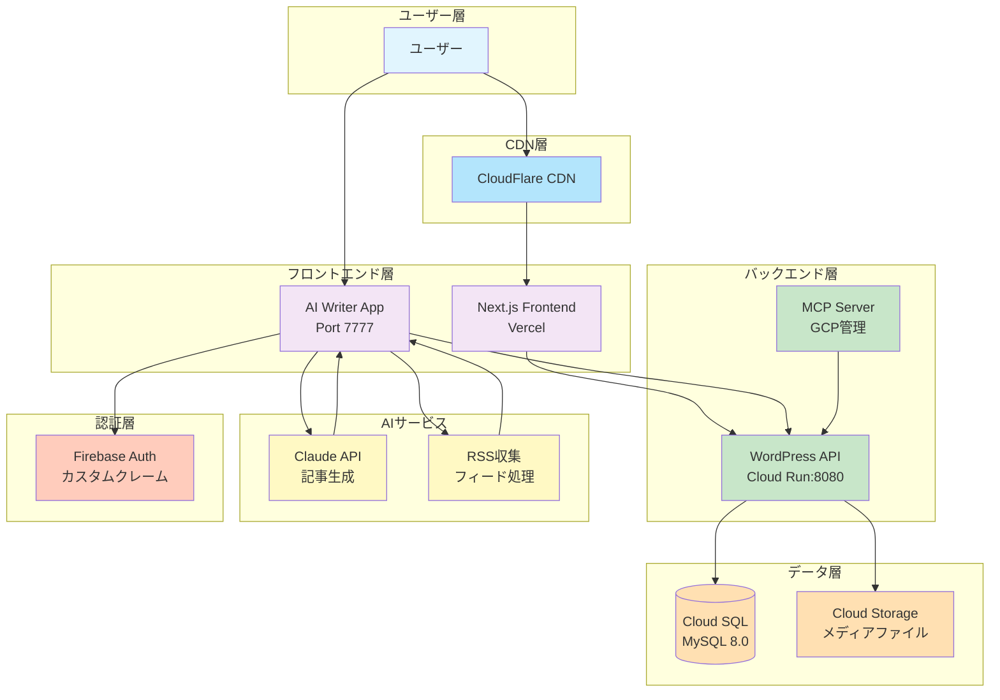
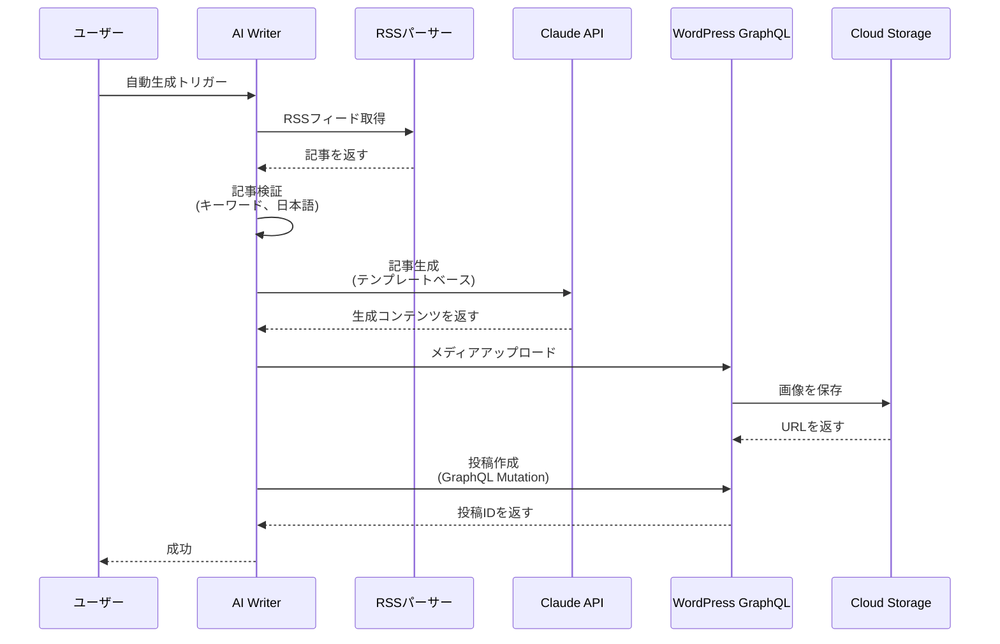
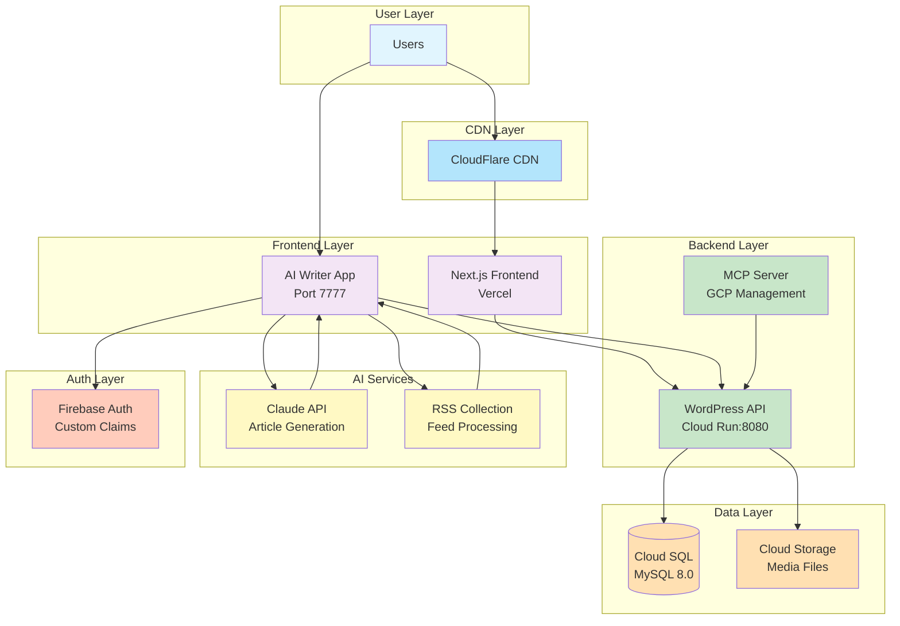
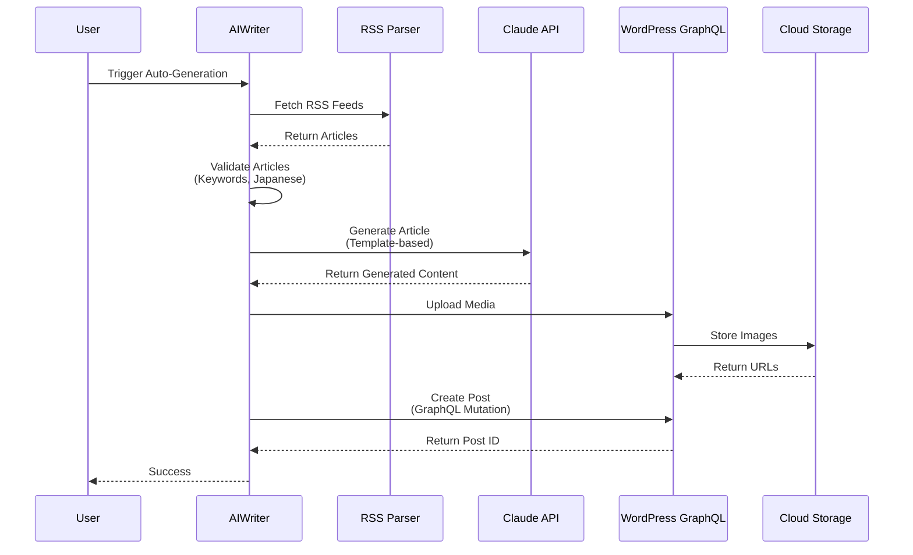

# Revolution 日本語版

AI記事生成機能を備えたモダンなJamstackプラットフォームを個人開発で挑戦する。

## 📖 概要

**Revolution**は、ヘッドレスCMSとしてWordPressを活用し、フロントエンドにNext.jsを採用した総合Webプラットフォームです。AI駆動のコンテンツ生成機能を強化し、モノレポ構成でモダンなフルスタック開発手法とクラウドネイティブアーキテクチャを実証しています。

### 主要機能

- 🤖 **AIコンテンツパイプライン**: AI → Headless CMS自動投稿
- ⚡ **ヘッドレスCMS**: WordPress GraphQL API と Next.js SSG/ISR
- ☁️ **クラウドネイティブ**: Google Cloud Run上のコンテナ化WordPress
- 📱 **マルチプラットフォーム**: Web（Next.js）+ モバイル（Flutter）対応
- 🔐 **セキュア**: Firebase認証とカスタムクレーム
- 🧪 **テストカバレッジ**: Jest + Firebase Emulator による包括的なユニットテスト

---

## 🏗️ アーキテクチャ

### システム構成図



### データフロー: AI記事生成



---

## 🛠️ 技術スタック

### フロントエンドアプリケーション

| コンポーネント | 技術 | 用途 |
|-----------|-----------|---------|
| **メインフロントエンド** | Next.js 15.5, React 19, TypeScript 5 |  公開Webサイト |
| **AI Writer** | Next.js 15.5, Firebase, Anthropic SDK | コンテンツ生成管理画面 |
| **モバイルアプリ** | Coming soon | -クロスプラットフォームモバイル |

### バックエンド & インフラストラクチャ

| コンポーネント | 技術 | 詳細 |
|-----------|-----------|---------|
| **CMS** | WordPress 6.7, PHP 8.4 | GraphQLを使用したヘッドレスモード |
| **データベース** | Cloud SQL (MySQL 8.0) | コスト最適化ティア |
| **ストレージ** | Cloud Storage | 公開メディアファイル |
| **コンテナ** | Docker, Cloud Run | マルチステージビルド |
| **認証** | Firebase Authentication | 認可用カスタムクレーム |

### AI & 統合

| サービス | 用途 | パッケージ |
|---------|---------|---------|
| **Claude API** | 記事生成 | `@anthropic-ai/sdk` |
| **RSS Parser** | フィード収集 | `rss-parser` |
| **Article Extractor** | URLコンテンツ抽出 | `@extractus/article-extractor` |
| **GraphQL Codegen** | 型安全なWordPress API | `@graphql-codegen/*` |

### 開発ツール

| ツール | バージョン | 用途 |
|------|---------|---------|
| **pnpm** | 10.11.0 | 高速パッケージマネージャー |
| **Turbo** | 2.5+ | モノレポビルドシステム |
| **Jest** | 30.2+ | ユニットテスト |
| **Firebase Emulator** | - | ローカル認証/DBテスト |
| **ESLint + Prettier** | Latest | コード品質 |

---

## 📁 プロジェクト構造

```
revolution/
├── 🎨 apps/
│   ├── ai-writer/                    # AIコンテンツ生成管理アプリ
│   │   ├── app/                      # Next.js App Router
│   │   │   ├── api/                  # APIルート
│   │   │   │   ├── articles/         # 記事生成エンドポイント
│   │   │   │   ├── debug/            # デバッグ&テストエンドポイント
│   │   │   │   ├── rss/              # RSS収集エンドポイント
│   │   │   │   └── wordpress/        # WordPress統合
│   │   │   ├── debug/                # デバッグUI画面
│   │   │   ├── debug-rss/            # RSSデバッグ画面
│   │   │   ├── login/                # 認証画面
│   │   │   └── rss-feeds/            # フィード管理UI
│   │   ├── lib/                      # コアビジネスロジック
│   │   │   ├── auth/                 # Firebase認証コンテキスト
│   │   │   ├── firebase/             # Firebaseクライアント&管理
│   │   │   ├── services/             # サービス層
│   │   │   │   ├── article-generation.service.ts
│   │   │   │   ├── claude-api.service.ts
│   │   │   │   ├── rss-article-collection.service.ts
│   │   │   │   ├── rss-feed.service.ts
│   │   │   │   └── wordpress-graphql.service.ts
│   │   │   └── types/                # TypeScript型定義
│   │   ├── __tests__/                # Jestテストスイート
│   │   │   ├── lib/services/         # サービステスト
│   │   │   ├── unit/                 # ユニットテスト
│   │   │   └── test-helpers/         # テストユーティリティ
│   │   ├── components/               # Reactコンポーネント
│   │   ├── codegen.yml               # GraphQLコード生成設定
│   │   ├── firebase.json             # Firebase設定
│   │   ├── jest.config.mjs           # Jest設定
│   │   └── package.json              # 依存関係&スクリプト
│   │
│   ├── backend/                      # WordPressヘッドレスCMS
│   │   ├── wp-content/
│   │   │   ├── mu-plugins/           # 必須プラグイン
│   │   │   │   └── gcs-media-integration.php  # Cloud Storage統合
│   │   │   ├── plugins/              # カスタムプラグイン
│   │   │   └── themes/               # WordPressテーマ
│   │   ├── scripts/
│   │   │   ├── deploy.sh             # ✅ Cloud Runデプロイ
│   │   │   └── setup-wordpress.sh    # 初期セットアップ
│   │   ├── Dockerfile                # マルチステージコンテナビルド
│   │   ├── docker-compose.yml        # ローカル開発環境
│   │   ├── wp-config.php             # WordPress設定
│   │   └── wp-config.local.php       # ローカル環境設定
│   │
│   ├── frontend/                     # メインNext.js Webサイト
│   │   ├── app/                      # App Routerページ
│   │   ├── components/               # UIコンポーネント（Atomic Design）
│   │   │   ├── atoms/
│   │   │   ├── molecules/
│   │   │   ├── organisms/
│   │   │   └── templates/
│   │   ├── services/                 # ビジネスロジック層
│   │   ├── repositories/             # データアクセス層
│   │   ├── hooks/                    # カスタムReact Hooks
│   │   ├── types/                    # TypeScript型定義
│   │   └── constants/                # GraphQLクエリ&定数
│   │
│   ├── mcp-gcp-server/               # Model Context Protocolサーバー
│   │   ├── src/
│   │   │   ├── handlers/             # MCPリクエストハンドラー
│   │   │   ├── services/             # GCP APIサービス
│   │   │   └── index.ts              # サーバーエントリーポイント
│   │   └── package.json
│   │
│   └── flutter/                      # Flutterモバイルアプリ（予定）
│       ├── lib/
│       └── pubspec.yaml
│
├── 📚 docs/                          # プロジェクトドキュメント
│   ├── 00-meta/                      # ドキュメント作成ガイドライン
│   ├── 01-arch/                      # アーキテクチャドキュメント
│   ├── 02-mono/                      # モノレポ管理
│   ├── 03-cloud-infrastructure/      # GCPインフラ
│   ├── 04-backend/                   # WordPressバックエンドドキュメント
│   ├── 05-frontend/                  # Next.jsフロントエンドドキュメント
│   ├── 06-ops/                       # 運用&スクリプト
│   ├── 07-build/                     # ビルドシステム
│   ├── 08-cicd/                      # CI/CDパイプライン
│   ├── 11-ai/                        # AI統合
│   └── 12-tools/                     # 開発ツール
│
├── 🔧 shared/                        # ワークスペース間で共有されるコード
│   ├── types/                        # 共通TypeScript型定義
│   ├── utils/                        # ユーティリティ関数
│   └── schemas/                      # バリデーションスキーマ
│
├── 🚀 scripts/                       # 自動化スクリプト
│   ├── deploy.sh                     # ⚠️ 未完成 - apps/backend/scripts/deploy.shを使用
│   ├── sync-docs-to-icloud.sh        # ドキュメント同期
│   └── create-doc-and-sync.sh        # ドキュメント作成ヘルパー
│
├── 📖 reference/                     # リファレンス実装
│   ├── nextjs/                       # Next.jsソースコード
│   ├── wordpress/                    # WordPressコア
│   ├── wp-graphql/                   # WPGraphQLプラグイン
│   └── jest/                         # Jestテスト
│
├── CLAUDE.md                         # AIアシスタント向け説明（日本語）
├── GEMINI.md                         # AIアシスタント向け説明（英語）
├── Makefile                          # ビルド自動化
├── package.json                      # ルートパッケージ設定
├── pnpm-workspace.yaml               # ワークスペース設定
└── turbo.json                        # Turboキャッシュ設定
```

---

## 🚀 はじめに

### 前提条件

- **Node.js**: 20.0.0以上
- **pnpm**: 9.0.0以上
- **Docker**: ローカルWordPress開発用
- **Google Cloud SDK**: Cloud Runデプロイ用

### インストール

```bash
# リポジトリのクローン
git clone https://github.com/yourusername/revolution.git
cd revolution

# 依存関係のインストール
pnpm install

# 環境変数の設定
cp apps/ai-writer/.env.sample apps/ai-writer/.env.local
cp apps/frontend/.env.sample apps/frontend/.env.local

# 開発環境の起動（全ワークスペース）
make dev
```

### 環境変数

#### AI Writer (`apps/ai-writer/.env.local`)

```bash
# Firebase設定
NEXT_PUBLIC_FIREBASE_API_KEY=your_api_key
NEXT_PUBLIC_FIREBASE_PROJECT_ID=your_project_id
NEXT_PUBLIC_FIREBASE_AUTH_DOMAIN=your_project.firebaseapp.com
# ... (全リストは.env.sampleを参照)

# Anthropic API
ANTHROPIC_API_KEY=your_anthropic_api_key

# WordPress GraphQLエンドポイント
NEXT_PUBLIC_WP_ENDPOINT=http://localhost:8080/graphql

# 管理者メールアドレス（カンマ区切り）
ADMIN_EMAILS=admin@example.com
```

#### Frontend (`apps/frontend/.env.local`)

```bash
# WordPress GraphQLエンドポイント
NEXT_PUBLIC_WP_ENDPOINT=http://localhost:8080/graphql

# 画像最適化
ALLOWED_IMAGE_HOST=localhost
```

---

## 💻 開発コマンド

### ルートレベル（モノレポ）

```bash
# 開発
make dev              # 全ワークスペースを起動
pnpm dev:frontend     # フロントエンドのみ
pnpm dev:backend      # バックエンドのみ（Docker）

# ビルド
make build            # 全ワークスペースをビルド
pnpm build:frontend   # フロントエンドのみ
pnpm build:backend    # バックエンドのみ

# テスト & 品質
pnpm test             # 全テストを実行
pnpm lint             # 全ワークスペースをLint
pnpm type-check       # TypeScript検証

# クリーンアップ
make clean            # ビルド成果物を削除
pnpm fresh            # クリーンインストール
```

### AI Writer アプリ

```bash
cd apps/ai-writer

# 開発
pnpm dev              # ポート7777で起動
pnpm restart          # 強制終了&再起動

# テスト
pnpm test             # Jestテストを実行
pnpm test:watch       # ウォッチモード
pnpm test:coverage    # カバレッジレポート
pnpm test:emulator    # Firebase Emulatorと共に実行

# GraphQLコード生成
pnpm codegen          # スキーマから型を生成
pnpm codegen:watch    # ウォッチモード

# Firebase管理者
pnpm admin:setup      # 管理者ユーザーをセットアップ
pnpm admin:list       # 管理者をリスト表示
pnpm admin:remove <email>  # 管理者を削除
```

### バックエンド（WordPress）

```bash
cd apps/backend

# ローカル開発
docker-compose up -d          # コンテナを起動
docker-compose logs -f        # ログを表示
docker-compose down           # コンテナを停止

# デプロイ
./scripts/deploy.sh           # Cloud Runへデプロイ
```

### ドキュメント

```bash
# iCloudへドキュメントを同期（iPad閲覧用）
pnpm docs:sync

# 新しいドキュメントを作成して同期
pnpm docs:create

# ドキュメントインデックスを生成
pnpm docs:build-toc
```

---

## 🧪 テスト

### AI Writer テストスイート

```bash
cd apps/ai-writer

# 全テストを実行
pnpm test

# 特定のテストスイートを実行
pnpm test:unit                # ユニットテストのみ
pnpm test:integration         # 統合テスト

# Firebase Emulatorと共に実行
pnpm emulators:start          # エミュレーターを起動
pnpm test:emulator            # エミュレーターと共にテスト実行
```

### テストカバレッジ

- ✅ RSS記事収集サービス
- ✅ 記事生成サービス
- ✅ バリデーションロジック
- ✅ Firebase認証モック
- ✅ WordPress GraphQLモック

---

## 🚢 デプロイ

### フロントエンド（Vercel）

```bash
cd apps/frontend

# 本番環境へデプロイ
vercel --prod

# またはルートから
pnpm deploy:frontend
```

### バックエンド（Cloud Run）

```bash
cd apps/backend

# WordPressをCloud Runへデプロイ
./scripts/deploy.sh

# またはルートから
pnpm deploy:backend
```

**⚠️ 重要**: ルートの`scripts/deploy.sh`は未完成です。必ず`apps/backend/scripts/deploy.sh`を使用してください。

### AI Writer（Vercel）

```bash
cd apps/ai-writer

# Vercelへデプロイ
vercel --prod
```

---

## ⚠️ 既知の問題と制限事項

### 1. ルートデプロイスクリプト

**問題**: リポジトリルートの`scripts/deploy.sh`は未完成です。

**解決策**: バックエンドデプロイには`apps/backend/scripts/deploy.sh`を使用してください。

```bash
# ❌ これは使用しないでください
./scripts/deploy.sh

# ✅ 代わりにこれを使用
cd apps/backend && ./scripts/deploy.sh
```

### 2. バックエンドポート設定

WordPressコンテナはCloud Run互換のため、ポート**8080**で実行する必要があります。

```yaml
# docker-compose.yml
ports:
  - "8080:8080"  # ✅ 正しい
  # 6666やその他のポートは使用不可
```

### 3. 本番環境でのコンソールログ

**セキュリティ注意**: 本番環境デプロイ前にデバッグログを削除してください:

```typescript
// apps/ai-writer/lib/firebase/admin.ts:12-14
// ❌ 本番環境では削除してください
console.log('[Firebase Admin] Project ID:', process.env.FIREBASE_PROJECT_ID);
console.log('[Firebase Admin] Client Email:', process.env.FIREBASE_CLIENT_EMAIL);
```

本番環境ではデバッグAPIエンドポイントを無効化してください。

---

## 📱 オプション: iCloudドキュメント同期

iPad閲覧用にドキュメントをiCloud Driveへ同期します。

### セットアップ

```bash
# 環境変数テンプレートをコピー
cp .env.local.example .env.local

# パスを編集
PROJECT_ROOT="/path/to/revolution"
ICLOUD_DRIVE_PATH="/Users/YOUR_USERNAME/Library/Mobile Documents/YOUR_APP"
```

### 使用方法

```bash
# 全ドキュメントを同期
./scripts/sync-docs-to-icloud.sh

# 新しいドキュメントを作成して同期
./scripts/create-doc-and-sync.sh docs 04-backend/BE-new-feature.md
```

**同期先:**
- 公開ドキュメント → `iCloud/{REPO_NAME}/docs/`
- 機密ドキュメント → `iCloud/{REPO_NAME}/dot-claude/`

---

## 🤝 コントリビューション

これは個人的な学習プロジェクトですが、提案やフィードバックは歓迎します！

### 開発ワークフロー

1. フィーチャーブランチを作成: `feature/your-feature-name`
2. コンベンショナルコミットで変更
3. テストを実行: `pnpm test`
4. `main`へプルリクエストを作成

### コミット規約

```bash
✨ feat: 新機能追加
🐛 fix: バグ修正
📝 docs: ドキュメント
🔧 config: 設定変更
♻️  refactor: コードリファクタリング
🧪 test: テスト追加
```

---

## 📄 ライセンス

このプロジェクトは、個人としての挑戦・学習を実績として公開するリポジトリです。モダンなフルスタック開発とクラウドネイティブアーキテクチャの学習過程で得た知見と技術的成果を共有することを目的としています。

依存関係の個別パッケージについては、それぞれのライセンスを確認してください。

---

## 🙏 謝辞

以下を使用して構築:
- [Next.js](https://nextjs.org/) - Reactフレームワーク
- [WordPress](https://wordpress.org/) - CMS
- [WPGraphQL](https://www.wpgraphql.com/) - WordPress用GraphQL
- [Anthropic Claude](https://www.anthropic.com/) - AI API
- [Firebase](https://firebase.google.com/) - 認証
- [Google Cloud](https://cloud.google.com/) - インフラストラクチャ

---

# Revolution English:

A personal project exploring a modern Jamstack platform with AI-powered content generation.

## 📖 Overview

**Revolution** is a comprehensive web platform combining headless WordPress as a CMS with Next.js for the frontend, enhanced by AI-powered content generation capabilities. Built as a monorepo, it demonstrates modern full-stack development practices with cloud-native architecture.

### Key Features

- 🤖 **AI Content Pipeline**: Automated RSS collection → AI article generation → WordPress publishing
- ⚡ **Headless CMS**: WordPress GraphQL API with Next.js SSG/ISR
- ☁️ **Cloud Native**: Containerized WordPress on Google Cloud Run
- 📱 **Multi-Platform**: Web (Next.js) + Mobile (Flutter) ready
- 🔐 **Secure**: Firebase Authentication with custom claims
- 🧪 **Test Coverage**: Comprehensive unit tests with Jest + Firebase Emulator

---

## 🏗️ Architecture

### System Diagram



### Data Flow: AI Article Generation



---

## 🛠️ Tech Stack

### Frontend Applications

| Component | Technology | Purpose |
|-----------|-----------|---------|
| **Main Frontend** | Next.js 15.5, React 19, TypeScript 5 | Public-facing website |
| **AI Writer** | Next.js 15.5, Firebase, Anthropic SDK | Content generation admin |
| **Mobile App** | Coming soon | Cross-platform mobile |

### Backend & Infrastructure

| Component | Technology | Details |
|-----------|-----------|---------|
| **CMS** | WordPress 6.7, PHP 8.4 | Headless mode with GraphQL |
| **Database** | Cloud SQL (MySQL 8.0) | Cost-optimized tier |
| **Storage** | Cloud Storage | Public media files |
| **Container** | Docker, Cloud Run | Multi-stage builds |
| **Auth** | Firebase Authentication | Custom claims for authorization |

### AI & Integration

| Service | Purpose | Package |
|---------|---------|---------|
| **Claude API** | Article generation | `@anthropic-ai/sdk` |
| **RSS Parser** | Feed collection | `rss-parser` |
| **Article Extractor** | URL content extraction | `@extractus/article-extractor` |
| **GraphQL Codegen** | Type-safe WordPress API | `@graphql-codegen/*` |

### Development Tools

| Tool | Version | Purpose |
|------|---------|---------|
| **pnpm** | 10.11.0 | Fast package manager |
| **Turbo** | 2.5+ | Monorepo build system |
| **Jest** | 30.2+ | Unit testing |
| **Firebase Emulator** | - | Local auth/db testing |
| **ESLint + Prettier** | Latest | Code quality |

---

## 📁 Project Structure

```
revolution/
├── 🎨 apps/
│   ├── ai-writer/                    # AI Content Generation Admin App
│   │   ├── app/                      # Next.js App Router
│   │   │   ├── api/                  # API Routes
│   │   │   │   ├── articles/         # Article generation endpoints
│   │   │   │   ├── debug/            # Debug & testing endpoints
│   │   │   │   ├── rss/              # RSS collection endpoints
│   │   │   │   └── wordpress/        # WordPress integration
│   │   │   ├── debug/                # Debug UI pages
│   │   │   ├── debug-rss/            # RSS debugging pages
│   │   │   ├── login/                # Authentication pages
│   │   │   └── rss-feeds/            # Feed management UI
│   │   ├── lib/                      # Core business logic
│   │   │   ├── auth/                 # Firebase auth context
│   │   │   ├── firebase/             # Firebase client & admin
│   │   │   ├── services/             # Service layer
│   │   │   │   ├── article-generation.service.ts
│   │   │   │   ├── claude-api.service.ts
│   │   │   │   ├── rss-article-collection.service.ts
│   │   │   │   ├── rss-feed.service.ts
│   │   │   │   └── wordpress-graphql.service.ts
│   │   │   └── types/                # TypeScript types
│   │   ├── __tests__/                # Jest test suite
│   │   │   ├── lib/services/         # Service tests
│   │   │   ├── unit/                 # Unit tests
│   │   │   └── test-helpers/         # Test utilities
│   │   ├── components/               # React components
│   │   ├── codegen.yml               # GraphQL code generation config
│   │   ├── firebase.json             # Firebase config
│   │   ├── jest.config.mjs           # Jest configuration
│   │   └── package.json              # Dependencies & scripts
│   │
│   ├── backend/                      # WordPress Headless CMS
│   │   ├── wp-content/
│   │   │   ├── mu-plugins/           # Must-use plugins
│   │   │   │   └── gcs-media-integration.php  # Cloud Storage
│   │   │   ├── plugins/              # Custom plugins
│   │   │   └── themes/               # WordPress themes
│   │   ├── scripts/
│   │   │   ├── deploy.sh             # ✅ Cloud Run deployment
│   │   │   └── setup-wordpress.sh    # Initial setup
│   │   ├── Dockerfile                # Multi-stage container build
│   │   ├── docker-compose.yml        # Local development
│   │   ├── wp-config.php             # WordPress configuration
│   │   └── wp-config.local.php       # Local environment config
│   │
│   ├── frontend/                     # Main Next.js Website
│   │   ├── app/                      # App Router pages
│   │   ├── components/               # UI components (Atomic Design)
│   │   │   ├── atoms/
│   │   │   ├── molecules/
│   │   │   ├── organisms/
│   │   │   └── templates/
│   │   ├── services/                 # Business logic layer
│   │   ├── repositories/             # Data access layer
│   │   ├── hooks/                    # Custom React hooks
│   │   ├── types/                    # TypeScript types
│   │   └── constants/                # GraphQL queries & constants
│   │
│   ├── mcp-gcp-server/               # Model Context Protocol Server
│   │   ├── src/
│   │   │   ├── handlers/             # MCP request handlers
│   │   │   ├── services/             # GCP API services
│   │   │   └── index.ts              # Server entry point
│   │   └── package.json
│   │
│   └── flutter/                      # Flutter Mobile App (planned)
│       ├── lib/
│       └── pubspec.yaml
│
├── 📚 docs/                          # Project documentation
│   ├── 00-meta/                      # Documentation guidelines
│   ├── 01-arch/                      # Architecture docs
│   ├── 02-mono/                      # Monorepo management
│   ├── 03-cloud-infrastructure/      # GCP infrastructure
│   ├── 04-backend/                   # WordPress backend docs
│   ├── 05-frontend/                  # Next.js frontend docs
│   ├── 06-ops/                       # Operations & scripts
│   ├── 07-build/                     # Build system
│   ├── 08-cicd/                      # CI/CD pipelines
│   ├── 11-ai/                        # AI integration
│   └── 12-tools/                     # Development tools
│
├── 🔧 shared/                        # Shared code across workspaces
│   ├── types/                        # Common TypeScript types
│   ├── utils/                        # Utility functions
│   └── schemas/                      # Validation schemas
│
├── 🚀 scripts/                       # Automation scripts
│   ├── deploy.sh                     # ⚠️ WIP - Use apps/backend/scripts/deploy.sh
│   ├── sync-docs-to-icloud.sh        # Documentation sync
│   └── create-doc-and-sync.sh        # Doc creation helper
│
├── 📖 reference/                     # Reference implementations
│   ├── nextjs/                       # Next.js source code
│   ├── wordpress/                    # WordPress core
│   ├── wp-graphql/                   # WPGraphQL plugin
│   └── jest/                         # Jest testing
│
├── CLAUDE.md                         # AI assistant instructions (JP)
├── GEMINI.md                         # AI assistant instructions (EN)
├── Makefile                          # Build automation
├── package.json                      # Root package config
├── pnpm-workspace.yaml               # Workspace configuration
└── turbo.json                        # Turbo cache config
```

---

## 🚀 Getting Started

### Prerequisites

- **Node.js**: 20.0.0 or higher
- **pnpm**: 9.0.0 or higher
- **Docker**: For local WordPress development
- **Google Cloud SDK**: For Cloud Run deployment

### Installation

```bash
# Clone repository
git clone https://github.com/yourusername/revolution.git
cd revolution

# Install dependencies
pnpm install

# Setup environment variables
cp apps/ai-writer/.env.sample apps/ai-writer/.env.local
cp apps/frontend/.env.sample apps/frontend/.env.local

# Start development (all workspaces)
make dev
```

### Environment Variables

#### AI Writer (`apps/ai-writer/.env.local`)

```bash
# Firebase Configuration
NEXT_PUBLIC_FIREBASE_API_KEY=your_api_key
NEXT_PUBLIC_FIREBASE_PROJECT_ID=your_project_id
NEXT_PUBLIC_FIREBASE_AUTH_DOMAIN=your_project.firebaseapp.com
# ... (see .env.sample for full list)

# Anthropic API
ANTHROPIC_API_KEY=your_anthropic_api_key

# WordPress GraphQL Endpoint
NEXT_PUBLIC_WP_ENDPOINT=http://localhost:8080/graphql

# Admin Emails (comma-separated)
ADMIN_EMAILS=admin@example.com
```

#### Frontend (`apps/frontend/.env.local`)

```bash
# WordPress GraphQL Endpoint
NEXT_PUBLIC_WP_ENDPOINT=http://localhost:8080/graphql

# Image Optimization
ALLOWED_IMAGE_HOST=localhost
```

---

## 💻 Development Commands

### Root Level (Monorepo)

```bash
# Development
make dev              # Start all workspaces
pnpm dev:frontend     # Frontend only
pnpm dev:backend      # Backend only (Docker)

# Build
make build            # Build all workspaces
pnpm build:frontend   # Frontend only
pnpm build:backend    # Backend only

# Testing & Quality
pnpm test             # Run all tests
pnpm lint             # Lint all workspaces
pnpm type-check       # TypeScript validation

# Cleanup
make clean            # Clean build artifacts
pnpm fresh            # Clean install
```

### AI Writer App

```bash
cd apps/ai-writer

# Development
pnpm dev              # Start on port 7777
pnpm restart          # Kill & restart

# Testing
pnpm test             # Run Jest tests
pnpm test:watch       # Watch mode
pnpm test:coverage    # Coverage report
pnpm test:emulator    # With Firebase Emulator

# GraphQL Code Generation
pnpm codegen          # Generate types from schema
pnpm codegen:watch    # Watch mode

# Firebase Admin
pnpm admin:setup      # Setup admin users
pnpm admin:list       # List admins
pnpm admin:remove <email>  # Remove admin
```

### Backend (WordPress)

```bash
cd apps/backend

# Local Development
docker-compose up -d          # Start containers
docker-compose logs -f        # View logs
docker-compose down           # Stop containers

# Deployment
./scripts/deploy.sh           # Deploy to Cloud Run
```

### Documentation

```bash
# Sync docs to iCloud (for iPad reading)
pnpm docs:sync

# Create new doc and sync
pnpm docs:create

# Build documentation index
pnpm docs:build-toc
```

---

## 🧪 Testing

### AI Writer Test Suite

```bash
cd apps/ai-writer

# Run all tests
pnpm test

# Run specific test suites
pnpm test:unit                # Unit tests only
pnpm test:integration         # Integration tests

# With Firebase Emulator
pnpm emulators:start          # Start emulators
pnpm test:emulator            # Run tests with emulator
```

### Test Coverage

- ✅ RSS Article Collection Service
- ✅ Article Generation Service
- ✅ Validation Logic
- ✅ Firebase Authentication Mock
- ✅ WordPress GraphQL Mock

---

## 🚢 Deployment

### Frontend (Vercel)

```bash
cd apps/frontend

# Deploy to production
vercel --prod

# Or from root
pnpm deploy:frontend
```

### Backend (Cloud Run)

```bash
cd apps/backend

# Deploy WordPress to Cloud Run
./scripts/deploy.sh

# Or from root
pnpm deploy:backend
```

**⚠️ Important**: Do NOT use root `scripts/deploy.sh` - it's incomplete. Always use `apps/backend/scripts/deploy.sh`.

### AI Writer (Vercel)

```bash
cd apps/ai-writer

# Deploy to Vercel
vercel --prod
```

---

## ⚠️ Known Issues & Limitations

### 1. Root Deployment Script

**Issue**: `scripts/deploy.sh` at repository root is incomplete.

**Solution**: Use `apps/backend/scripts/deploy.sh` for backend deployment.

```bash
# ❌ Don't use this
./scripts/deploy.sh

# ✅ Use this instead
cd apps/backend && ./scripts/deploy.sh
```

### 2. Backend Port Configuration

WordPress container **must** run on port **8080** for Cloud Run compatibility.

```yaml
# docker-compose.yml
ports:
  - "8080:8080"  # ✅ Correct
  # NOT 6666 or other ports
```

### 3. Console Logging in Production

**Security Note**: Before production deployment, remove debug logs:

```typescript
// apps/ai-writer/lib/firebase/admin.ts:12-14
// ❌ Remove these in production
console.log('[Firebase Admin] Project ID:', process.env.FIREBASE_PROJECT_ID);
console.log('[Firebase Admin] Client Email:', process.env.FIREBASE_CLIENT_EMAIL);
```

Disable debug API endpoints in production environment.

---

## 📱 Optional: iCloud Documentation Sync

Sync documentation to iCloud Drive for iPad reading.

### Setup

```bash
# Copy environment template
cp .env.local.example .env.local

# Edit paths
PROJECT_ROOT="/path/to/revolution"
ICLOUD_DRIVE_PATH="/Users/YOUR_USERNAME/Library/Mobile Documents/YOUR_APP"
```

### Usage

```bash
# Sync all docs
./scripts/sync-docs-to-icloud.sh

# Create new doc and sync
./scripts/create-doc-and-sync.sh docs 04-backend/BE-new-feature.md
```

**Sync targets:**
- Public docs → `iCloud/{REPO_NAME}/docs/`
- Private docs → `iCloud/{REPO_NAME}/dot-claude/`

---

## 🤝 Contributing

This is a personal learning project, but suggestions and feedback are welcome!

### Development Workflow

1. Create feature branch: `feature/your-feature-name`
2. Make changes with conventional commits
3. Run tests: `pnpm test`
4. Create pull request to `main`

### Commit Convention

```bash
✨ feat: Add new feature
🐛 fix: Bug fix
📝 docs: Documentation
🔧 config: Configuration changes
♻️  refactor: Code refactoring
🧪 test: Add tests
```

---

## 📄 License

This repository showcases personal challenges and learning achievements in modern full-stack development. It serves as a demonstration of technical skills and knowledge gained through exploring cloud-native architecture and AI integration.

Please check individual package licenses in dependencies.

---

## 🙏 Acknowledgments

Built with:
- [Next.js](https://nextjs.org/) - React framework
- [WordPress](https://wordpress.org/) - CMS
- [WPGraphQL](https://www.wpgraphql.com/) - GraphQL for WordPress
- [Anthropic Claude](https://www.anthropic.com/) - AI API
- [Firebase](https://firebase.google.com/) - Authentication
- [Google Cloud](https://cloud.google.com/) - Infrastructure

