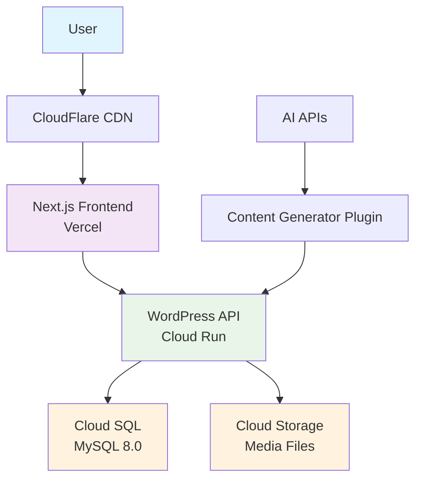

# Revolution

個人開発の学習と継続の挑戦を記録するプロジェクト。

## コンセプト

モダンなJamstackアーキテクチャを採用し、WordPressをHeadless CMSとして活用。フロントエンドには最新のNext.js 14を使用し、型安全で高速なWebプラットフォームを構築する。

## 技術的な挑戦

- 🔥 フルスタック開発: 1人でフロントエンド・バックエンド・インフラを担当する
- ⚡ パフォーマンス最適化: SSG/ISR + CDN による高速化
- 🛡️ 型安全性の追求: TypeScript + 自動型生成による開発効率化
- ☁️ クラウドネイティブ: コンテナ化 + マネージドサービス活用
- 🤖 AI統合: 生成AI APIを活用した自動化プラグイン開発

### 学習対象・選定技術

- **Frontend**: Next.js 14 + TypeScript + Tailwind CSS
- **Backend**: Docker-based Headless WordPress running on Google Cloud Run
- **Database**: Cloud SQL (MySQL 8.0)
- **Storage**: Cloud Storage
- **Deployment**: Vercel (Frontend) + Cloud Run (Backend)
- **CDN**: CloudFlare

## アーキテクチャ

### システム構成図



### 技術選択の理由

| 技術 | 選択理由 | 代替案との比較 |
|------|----------|----------------|
| **Next.js 14** | App Router、RSC、最新のReact機能 | Nuxt.js, Gatsby |
| **TypeScript** | 型安全性、開発効率、IDE支援 | JavaScript, Flow |
| **Headless WordPress** | 豊富なプラグイン、CMS機能充実 | MicroCMS, Strapi, Contentful |
| **Cloud Run** | サーバーレス、自動スケール、コスト効率 | App Engine, GKE |
| **pnpm + Turbo** | モノレポ高速化、効率的依存管理 | bun, npm, yarn |

## 技術スタック

### Frontend
- **Framework**: Next.js 14.2+ (App Router)
- **Language**: TypeScript 5.3+
- **Styling**: Tailwind CSS 3.3+ + Sass
- **State Management**: SWR (Server State) + React Hooks (Client State)
- **UI Components**: Headless UI + Hero Icons
- **Build Tool**: Turbo (Monorepo)

### Backend
- **CMS**: WordPress 6.7+ (Headless)
- **Runtime**: PHP 8.4 + Apache
- **Database**: Cloud SQL (MySQL 8.0)
- **Container**: Docker (Multi-stage build)
- **API**: REST API + Custom Endpoints

### Infrastructure
- **Frontend Hosting**: Vercel (Edge Network)
- **Backend Hosting**: Google Cloud Run (Gen 2)
- **Database**: Cloud SQL (High Availability)
- **Storage**: Cloud Storage (Multi-region)
- **CDN**: CloudFlare (Optional)
- **CI/CD**: GitHub Actions + Cloud Build

### Development
- **Package Manager**: pnpm 8.12+
- **Build System**: Turbo (Incremental Builds)
- **Linting**: ESLint + Prettier
- **Type Checking**: TypeScript strict mode
- **Git Workflow**: Feature Branch + Pull Request

## 📦 プロジェクト構造 (予定)

以下のように構築する📝

```
revolution/
├── 🎨 apps/
│   ├── frontend/              # Next.js Application
│   │   ├── src/
│   │   │   ├── app/           # App Router Pages
│   │   │   ├── components/    # Reusable Components
│   │   │   ├── hooks/         # Custom Hooks (SWR)
│   │   │   ├── lib/           # Utilities & API Client
│   │   │   └── types/         # Component-specific Types
│   │   ├── public/            # Static Assets
│   │   └── package.json
│   │
│   └── backend/               # WordPress (Headless)
│       ├── wp-content/
│       │   ├── mu-plugins/    # Must-Use Plugins
│       │   │   └── gcs-integration/  # Cloud Storage Integration
│       │   └── plugins/       # Custom Plugins (AI Writer)
│       ├── Dockerfile         # Multi-stage Build
│       ├── docker-compose.yml # Local Development
│       └── scripts/           # Deployment Scripts
│
├── 🔧 shared/
│   ├── types/                 # Shared TypeScript Types
│   │   ├── wordpress.ts       # WordPress REST API Types
│   │   └── api.ts            # Common API Types
│   └── utils/                 # Common Utilities
│
├── ⚙️ config/
│   ├── environments.ts       # Environment Configuration
│   └── feature-flags.json    # Feature Toggle Management
│
├── 📚 docs/                   # Documentation
│   ├── API.md                # API Specification
│   ├── DEPLOYMENT.md         # Deployment Guide
│   └── ARCHITECTURE.md       # System Architecture
│
└── 🚀 scripts/                # Automation Scripts
    ├── deploy.sh             # ⚠️ 未完成 - apps/backend/scripts/deploy.sh を使用
    └── setup.sh              # Environment Setup
```

## ⚠️ 重要な注意事項

### デプロイスクリプトについて

**リポジトリルートの `scripts/deploy.sh` は未完成です。必ず `apps/backend/scripts/deploy.sh` を使用してください。**

```bash
# ❌ 使用しないでください
./scripts/deploy.sh

# ✅ 正しいデプロイ方法
cd apps/backend
./scripts/deploy.sh
```

リポジトリルートのデプロイスクリプトには以下の問題があります：
- 環境変数ファイルのパスが不正
- コメント行を処理しない危険な環境変数読み込み
- Dockerfileのパス解決の問題
- GCS Integration用の環境変数欠落

修正が完了するまで、バックエンド用のデプロイスクリプトを使用してください。