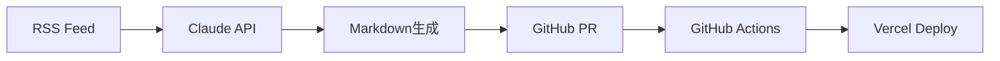

# MDX移行テスト記事：Revolution プロジェクトの新しい始まり

RevolutionプロジェクトがHeadless WordPressからMDXベースのJamstackアーキテクチャへ移行しました。

## なぜMDXなのか？

MDX（Markdown + JSX）を採用することで、以下のメリットを実現できます：

1. **ゼロコスト運用**: データベース不要、静的サイト生成でホスティングコスト最小化
2. **Git管理**: 記事がMarkdownファイルとして管理され、バージョン管理・差分追跡が容易
3. **React Componentsの埋め込み**: Markdown内で任意のReactコンポーネントを使用可能
4. **高速な配信**: CDN経由の静的ファイル配信で、最高のパフォーマンス

## アーキテクチャの概要

Phase 1の構成は以下の通りです：



### 主要コンポーネント

| コンポーネント | 技術スタック | 役割 |
|--------------|------------|------|
| フロントエンド | Next.js 14 + MDX | 静的サイト生成・配信 |
| AI Writer | Cloud Run + Claude | 記事自動生成 |
| CI/CD | GitHub Actions | ビルド・デプロイ自動化 |
| ホスティング | Vercel | グローバルCDN配信 |

## MDXの書き方

MDXでは通常のMarkdown記法に加えて、React Componentsを使用できます。

### コードブロック

```typescript
// TypeScriptのコード例
interface Article {
  title: string;
  slug: string;
  date: string;
  categories: string[];
  tags: string[];
}

const article: Article = {
  title: "Hello MDX",
  slug: "hello-mdx",
  date: "2025-11-15T10:00:00Z",
  categories: ["tech"],
  tags: ["mdx", "nextjs"]
};
```

### リスト

**メリット**:
- データベース不要
- Git管理
- 高速配信
- React Components埋め込み

**課題**:
- 大規模化時のビルド時間
- 全文検索の実装
- 動的コンテンツの扱い

### 引用

> "The best time to plant a tree was 20 years ago. The second best time is now."
>
> — Chinese Proverb

### 画像

Markdown標準の画像記法も使用できます：


## Next Steps

Phase 1の実装が完了したら、以下のフェーズに進みます：

1. **Phase 2**: Firestore導入（10万記事対応）
2. **Phase 3**: Edge/KV活用（大規模化）
3. **Phase 4**: モバイルアプリ化（Capacitor）

---

## まとめ

MDXベースのJamstackアーキテクチャへの移行により、Revolution プロジェクトは次のステージへと進化しました。

この記事が、同様のアーキテクチャ移行を検討している方々の参考になれば幸いです。

**関連記事**:
- [Phase 1アーキテクチャ詳細](/articles/phase1-architecture-detail)
- [AI Writer実装ガイド](/articles/ai-writer-implementation-guide)
- [GitHub Actions設定方法](/articles/github-actions-setup)
