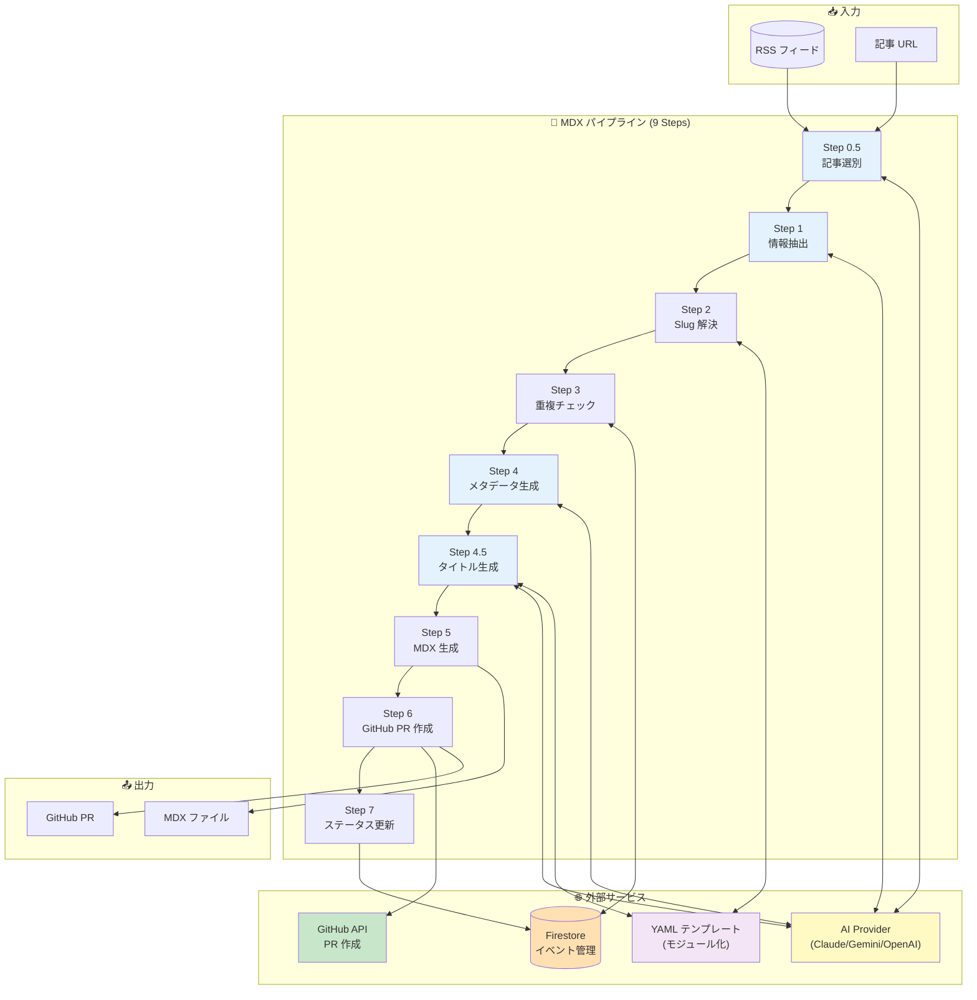
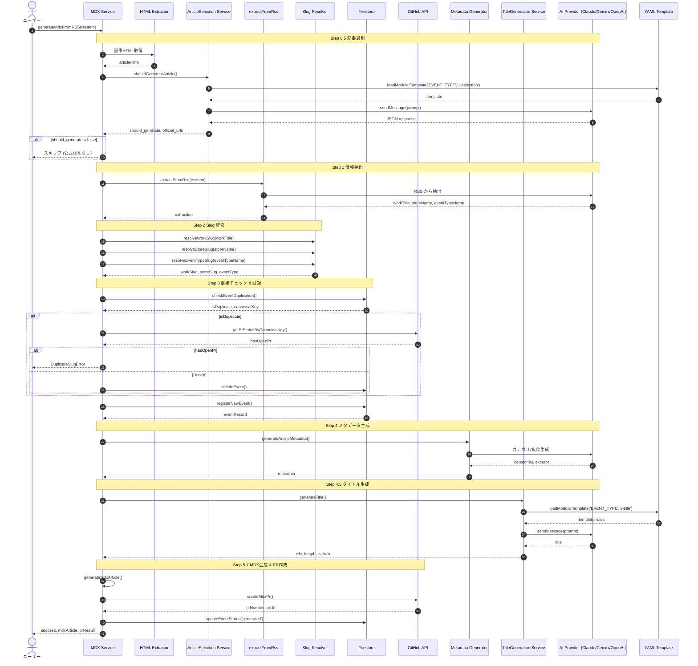
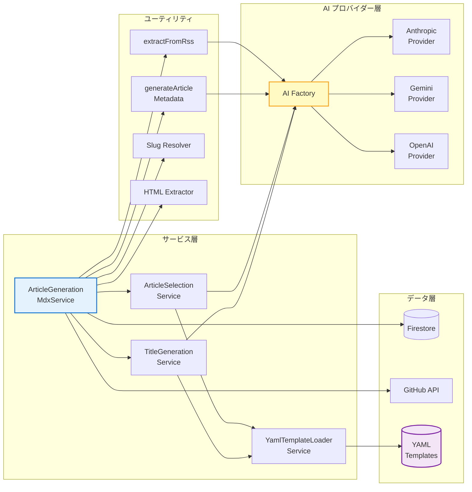
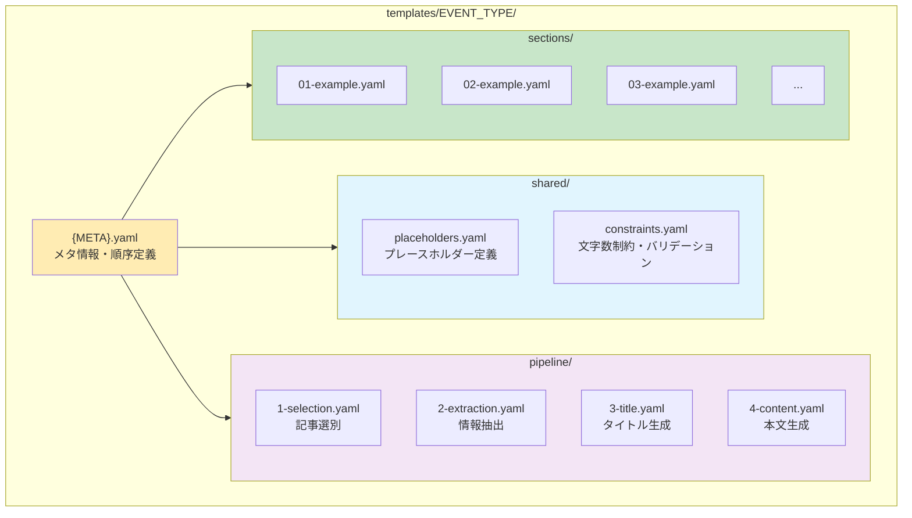
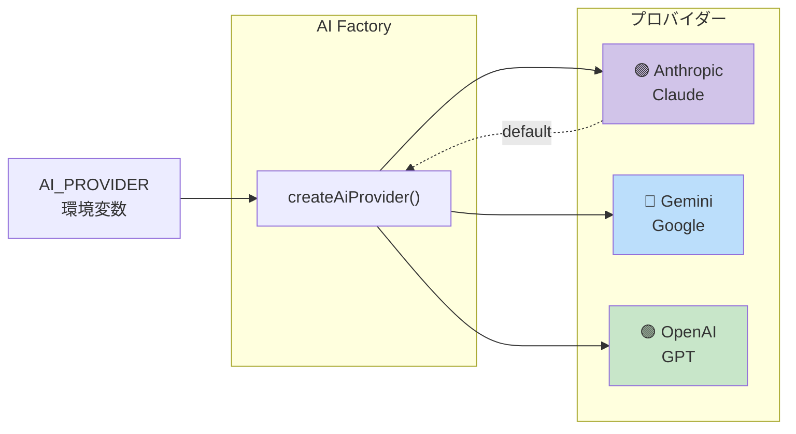

# MDX パイプライン アーキテクチャ

> Revolution の現行版 AI 記事生成パイプライン（MDX ベース）の全体像をまとめたドキュメントです。
> WordPress 版（レガシー）の構成は [`ARCH-project-overview.md`](./ARCH-project-overview.md) に残されていますが、現行のシステムは本ドキュメントを参照してください。

## 目次

- [パイプライン概要図](#パイプライン概要図)
- [詳細パイプラインフロー](#詳細パイプラインフロー)
- [サービス依存関係図](#サービス依存関係図)
- [YAML テンプレート モジュール構造](#yaml-テンプレート-モジュール構造)
- [マルチプロバイダー切り替え](#マルチプロバイダー切り替え)

---

## パイプライン概要図

現行 AI Writer は **RSS / URL → 9 ステップのパイプライン → MDX ファイル → GitHub PR** という流れで動作します。

---

## 詳細パイプラインフロー

各ステップの内部処理と外部サービスとのやり取りを sequenceDiagram 形式で示します。

---

## サービス依存関係図

各サービスがどのレイヤーに属し、どこに依存しているかを示します。

---

## YAML テンプレート モジュール構造

プロンプトはイベント種別ごとに `templates/EVENT_TYPE/` 配下にモジュール化されています。

---

## マルチプロバイダー切り替え

`AI_PROVIDER` 環境変数によって、AI Factory が呼び出すプロバイダー実装を切り替えます。

---

## 関連ドキュメント

- [現行版 技術スタック](./ARCH-current-stack.md)
- [プロジェクト全体アーキテクチャ（レガシー WordPress 含む歴史的経緯）](./ARCH-project-overview.md)
- [モノレポ運用](../02-mono/MONO-overview.md)
- [CI/CD（AI Writer Cloud Run デプロイ）](../08-cicd/CICD-ai-writer-cloud-run.md)
