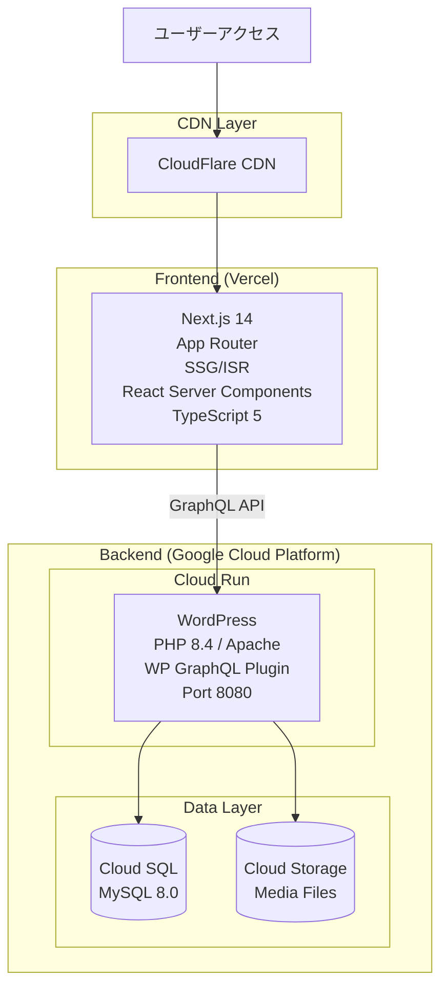
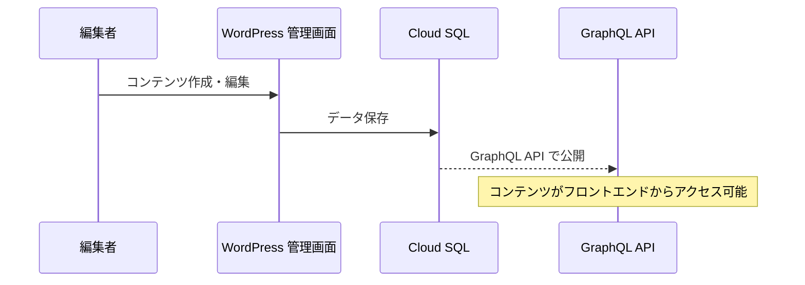
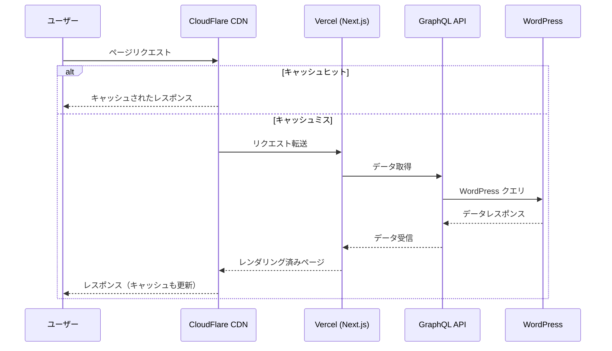
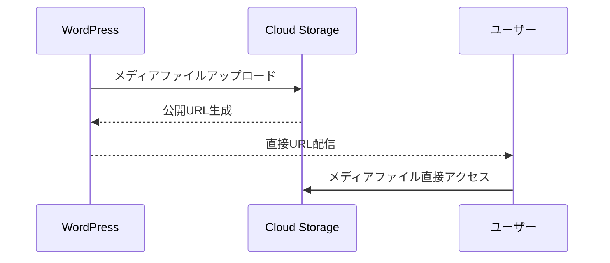

# Revolution プロジェクト アーキテクチャ概要

## プロジェクト概要

Revolution は、Next.js を用いたフロントエンドによるモダンな Jamstack アーキテクチャを採用し、CMS には Google Cloud Run 上の Docker 環境で稼働する Headless WordPress を利用する個人開発プロジェクトです。

## アーキテクチャ全体像



## 技術スタック

### フロントエンド（Next.js）
- **フレームワーク**: Next.js 14.2.4 (App Router)
- **言語**: TypeScript 5.9.2
- **スタイリング**: Tailwind CSS 3.4
- **データ取得**: SWR (クライアント) / fetch (サーバー)
- **UI コンポーネント**: Headless UI
- **デプロイ**: Vercel

### バックエンド（WordPress）
- **CMS**: WordPress 6.7
- **ランタイム**: PHP 8.4 + Apache
- **API**: WP GraphQL プラグイン
- **コンテナ**: Docker (Cloud Run 最適化)
- **デプロイ**: Google Cloud Run

### インフラストラクチャ
- **データベース**: Cloud SQL (MySQL 8.0)
- **メディアストレージ**: Cloud Storage
- **シークレット管理**: Secret Manager
- **CDN**: CloudFlare
- **モニタリング**: Cloud Logging

### 開発環境
- **モノレポ管理**: pnpm workspaces + Turborepo
- **タスクランナー**: Make + Turbo
- **コード品質**: ESLint, Prettier, TypeScript
- **ローカル環境**: Docker Compose

## ディレクトリ構造

```
revolution/
├── apps/
│   ├── frontend/          # Next.js アプリケーション
│   │   ├── app/           # App Router ページ
│   │   ├── components/    # React コンポーネント（Atomic Design）
│   │   ├── services/      # ビジネスロジック層
│   │   ├── repositories/  # データアクセス層
│   │   └── hooks/         # カスタムフック
│   └── backend/           # WordPress Docker 環境
│       ├── wp-content/    # WordPress コンテンツ
│       ├── Dockerfile     # Cloud Run 用イメージ
│       └── docker-compose.yml # ローカル開発環境
├── shared/                # 共有リソース
│   ├── schemas/          # JSON Schema 定義
│   ├── types/            # 共通型定義
│   └── utils/            # ユーティリティ関数
├── scripts/              # 統一デプロイ・セットアップスクリプト
├── docs/                 # プロジェクトドキュメント
├── Makefile              # 統合タスクランナー
├── turbo.json            # Turborepo 設定
└── pnpm-workspace.yaml   # pnpm ワークスペース設定
```

## データフロー

### 1. コンテンツ作成フロー


### 2. コンテンツ配信フロー


### 3. メディア配信フロー


## セキュリティ設計

### フロントエンド
- 環境変数による API エンドポイント管理
- CORS 設定による不正アクセス防止
- Next.js のセキュリティヘッダー自動設定

### バックエンド
- Cloud Run の自動スケーリングと DDoS 防護
- Secret Manager による認証情報管理
- Cloud SQL のプライベート IP 接続
- WordPress 管理画面の IP 制限（推奨）

### データ保護
- HTTPS 強制
- Cloud Storage のきめ細かいアクセス制御
- データベースの自動バックアップ

## パフォーマンス最適化

### フロントエンド最適化
- **SSG/ISR**: 静的生成とインクリメンタル再生成
- **画像最適化**: Next.js Image コンポーネント
- **コード分割**: 自動的な JS バンドル最適化
- **キャッシュ**: SWR によるクライアントキャッシュ

### バックエンド最適化
- **Cloud Run**: 自動スケーリング（0〜1000 インスタンス）
- **Cloud SQL**: 最適化された接続プール
- **GraphQL**: 効率的なクエリとキャッシュ
- **PHP OPcache**: コンパイル済みコードのキャッシュ

### ネットワーク最適化
- **CDN**: CloudFlare による地理的分散配信
- **HTTP/2**: 多重化による高速通信
- **Brotli 圧縮**: テキストリソースの圧縮

## 開発ワークフロー

### ローカル開発
1. `make dev` で統合開発環境起動
2. フロントエンド: http://localhost:4444
3. バックエンド: http://localhost:8080
4. GraphQL Playground: http://localhost:8080/graphql

### デプロイフロー
1. **フロントエンド**: `pnpm deploy:frontend` → Vercel 自動デプロイ
2. **バックエンド**: `pnpm deploy:backend` → Cloud Run デプロイ

### CI/CD パイプライン
- GitHub Actions による自動テスト（予定）
- プルリクエストごとのプレビューデプロイ（予定）
- main ブランチへのマージで本番デプロイ（予定）

## モニタリング・運用

### 監視項目
- **Cloud Run**: CPU/メモリ使用率、リクエスト数、レスポンス時間
- **Cloud SQL**: 接続数、クエリパフォーマンス、ストレージ使用量
- **Cloud Storage**: アクセス頻度、帯域幅使用量
- **Vercel**: ビルド時間、エッジ関数実行時間

### アラート設定
- サービス停止検知
- パフォーマンス劣化警告
- ストレージ容量警告
- 異常トラフィック検出

## コスト最適化

### 実装済み最適化
- Cloud Run の自動スケーリング（使用分のみ課金）
- Cloud SQL は MySQL 8.0（Enterprise Plus 回避）
- メディアファイルの Cloud Storage 直接配信
- Vercel の無料枠活用

### 今後の最適化案
- Cloud Run の最小インスタンス数調整
- Cloud SQL の自動停止設定（開発環境）
- Cloud Storage のライフサイクルポリシー
- CloudFlare キャッシュルールの最適化

## 技術的決定事項

### なぜ Headless CMS + Next.js？
- **開発効率**: WordPress の使い慣れた管理画面
- **パフォーマンス**: 静的生成による高速配信
- **スケーラビリティ**: フロントエンドとバックエンドの独立スケーリング
- **セキュリティ**: WordPress を直接公開しない

### なぜ Google Cloud Run？
- **コスト効率**: 使用分のみの課金
- **管理負荷軽減**: フルマネージドサービス
- **自動スケーリング**: トラフィックに応じた自動調整
- **コンテナ対応**: Docker イメージの直接デプロイ

### なぜ Turborepo + Make？
- **Turborepo**: Node.js エコシステムの最適化
- **Make**: Docker/インフラタスクの統合
- **併用理由**: 各ツールの強みを活かした役割分担

## 今後の拡張計画

### 短期計画
- [ ] GitHub Actions による CI/CD パイプライン構築
- [ ] Storybook によるコンポーネントカタログ
- [ ] E2E テストの導入（Playwright）
- [ ] パフォーマンスモニタリング強化

### 中長期計画
- [ ] マルチテナント対応
- [ ] GraphQL サブスクリプション
- [ ] エッジコンピューティング活用
- [ ] AI/ML 機能の統合

## 関連ドキュメント

- [モノレポ運用概要](../02-mono/MONO-overview.md)
- [GCP インフラ構築](../03-infra/INF-gc-cloud-run-docker-wp.md)
- [フロントエンド開発](../05-frontend/FE-nextjs-headless-cms.md)
- [CI/CD パイプライン](../08-cicd/CD-github-actions.md)
