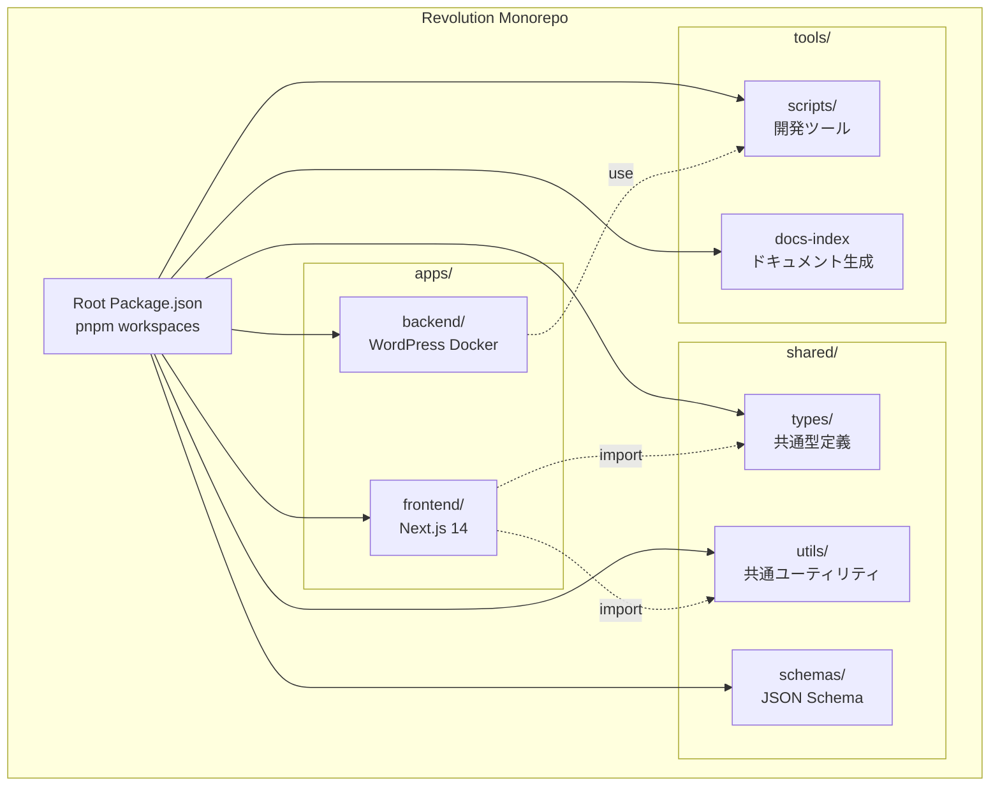
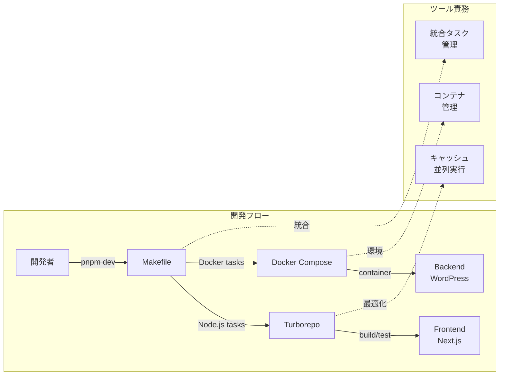
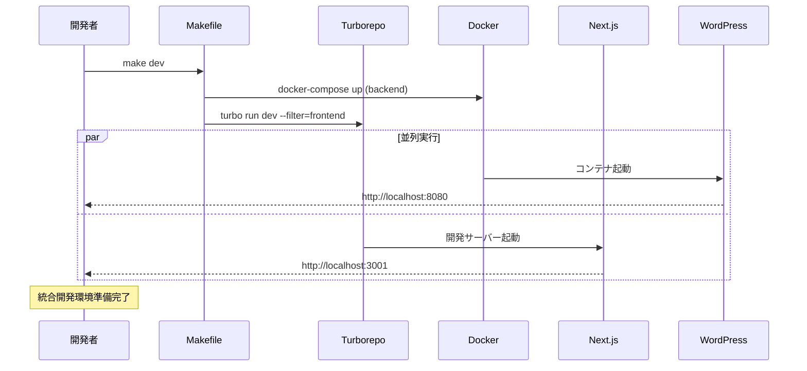
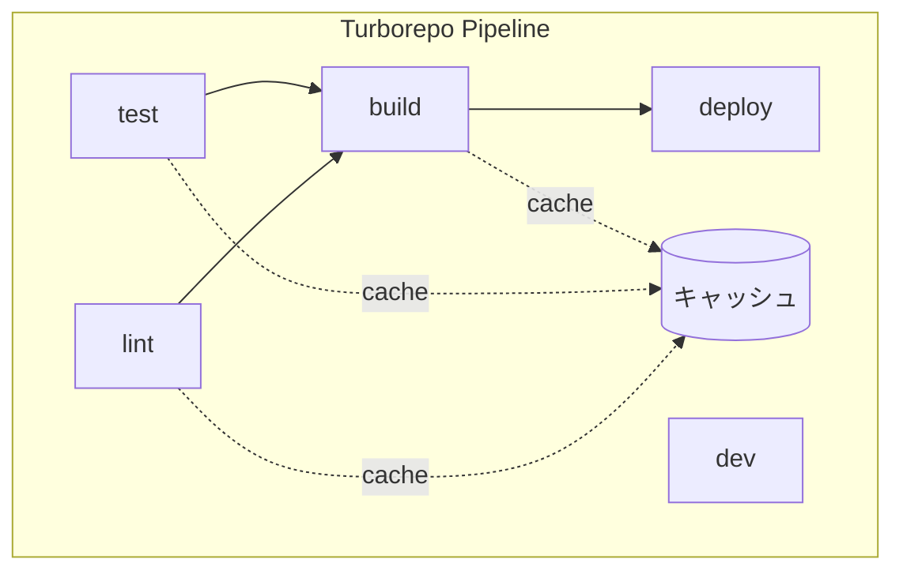
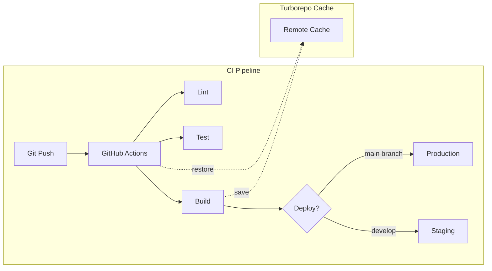

# モノレポ運用概要

## 概要

Revolution プロジェクトは、pnpm workspaces と Turborepo を活用したモノレポ構成を採用しています。フロントエンド（Next.js）とバックエンド（WordPress/Docker）を統合的に管理し、開発効率とコード品質の向上を実現します。

## モノレポアーキテクチャ



## ツールの役割分担



## ディレクトリ構造

```
revolution/
├── apps/                    # アプリケーション
│   ├── frontend/           # Next.js フロントエンド
│   │   ├── package.json    # Node.js 依存関係
│   │   └── ...
│   └── backend/            # WordPress バックエンド
│       ├── package.json    # 開発ツール用（最小限）
│       ├── Dockerfile      # コンテナ定義
│       └── docker-compose.yml
│
├── shared/                 # 共有リソース
│   ├── types/             # TypeScript 型定義
│   ├── utils/             # ユーティリティ関数
│   └── schemas/           # JSON Schema 定義
│
├── scripts/               # プロジェクト全体のスクリプト
├── docs/                  # ドキュメント
├── tools/                 # 開発ツール
│
├── package.json           # ルートパッケージ
├── pnpm-workspace.yaml    # ワークスペース設定
├── turbo.json            # Turborepo 設定
└── Makefile              # 統合タスクランナー
```

## 開発ワークフロー



## パッケージ管理戦略

### pnpm Workspaces の利点

1. **効率的な依存関係管理**
   - ハードリンクによるディスク容量削減
   - 厳密な依存関係解決
   - 高速なインストール

2. **モノレポ最適化**
   - ワークスペース間の依存関係管理
   - 共通パッケージの一元管理
   - バージョン整合性の保証

### Turborepo の活用



### タスク実行の最適化

- **並列実行**: 依存関係のないタスクを並列処理
- **キャッシュ**: ビルド結果をキャッシュして再利用
- **増分ビルド**: 変更された部分のみをビルド

## 開発コマンド

### 基本コマンド

```bash
# 開発環境起動（フロントエンド + バックエンド）
make dev

# フロントエンドのみ
pnpm dev:frontend

# バックエンドのみ
make backend

# ビルド
pnpm build

# テスト
pnpm test

# Lint
pnpm lint

# 型チェック
pnpm type-check
```

### 依存関係管理

```bash
# 依存関係インストール
pnpm install

# パッケージ追加（ワークスペース指定）
pnpm add <package> --filter=frontend

# パッケージ追加（ルート）
pnpm add -w <package>

# クリーンインストール
pnpm fresh
```

## CI/CD 統合



## ベストプラクティス

### 1. パッケージ間の依存関係

- 共通コードは `shared/` に配置
- 循環依存を避ける
- インターフェースで疎結合を保つ

### 2. スクリプトの一貫性

- 全パッケージで共通のスクリプト名を使用
  - `dev`: 開発サーバー
  - `build`: ビルド
  - `test`: テスト
  - `lint`: Lint

### 3. バージョン管理

- package.json のバージョンは semver に従う
- 破壊的変更は major バージョンアップ
- CHANGELOG.md でバージョン履歴を管理

### 4. 環境変数

- `.env.example` で必要な環境変数を文書化
- 環境ごとに適切な設定ファイルを用意
- Secret は絶対にコミットしない

## トラブルシューティング

### よくある問題

#### 1. pnpm install エラー

```bash
# ロックファイルの整合性チェック
pnpm install --frozen-lockfile

# キャッシュクリア
pnpm store prune
```

#### 2. Turborepo キャッシュ問題

```bash
# キャッシュクリア
pnpm turbo daemon clean
rm -rf node_modules/.cache/turbo
```

#### 3. ポート競合

```bash
# 使用中のポート確認
lsof -i :3001  # Frontend
lsof -i :8080  # Backend

# プロセス終了
kill -9 <PID>
```

## 拡張性とスケーラビリティ

### 新規パッケージ追加

1. `apps/` または `packages/` に新規ディレクトリ作成
2. package.json を配置
3. pnpm-workspace.yaml に追加（自動認識）
4. turbo.json にパイプライン設定追加

### パフォーマンス最適化

- Turborepo の Remote Caching 活用
- Docker イメージの最適化
- 並列処理の活用
- 不要な依存関係の削除

## まとめ

Revolution プロジェクトのモノレポ構成は、以下の利点を提供します：

1. **統合的な開発体験**: 単一リポジトリで全体を管理
2. **効率的なビルド**: Turborepo による最適化
3. **一貫性**: 共通の開発フロー・ツール
4. **スケーラビリティ**: 新規サービス追加が容易
5. **保守性**: 依存関係の一元管理

これらの特徴により、チーム開発の効率化と品質向上を実現します。

## 関連ドキュメント

- [アーキテクチャ概要](../01-arch/ARCH-project-overview.md)
- [ビルドツール戦略](../07-build/BUILD-turbo-vs-make-strategy.md)
- [スクリプトアーキテクチャ](../06-ops/OPS-scripts-architecture.md)
