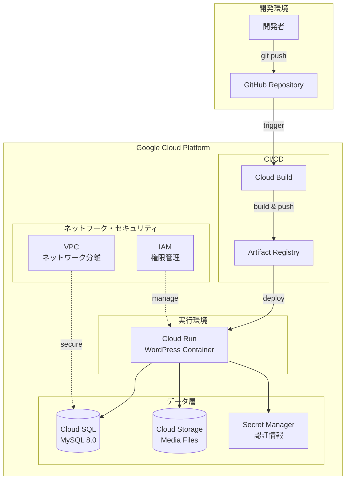
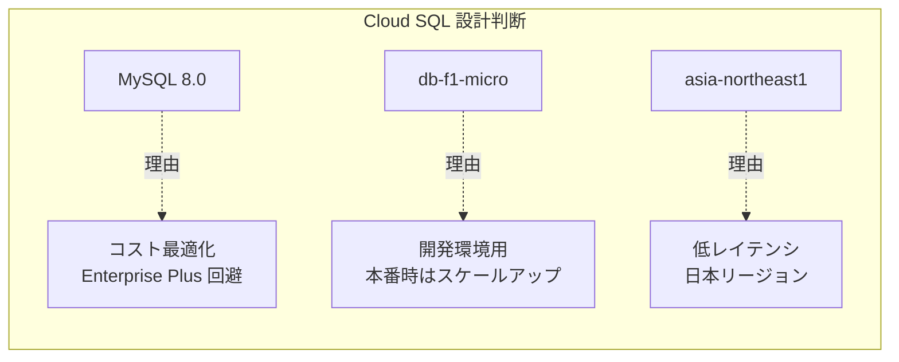
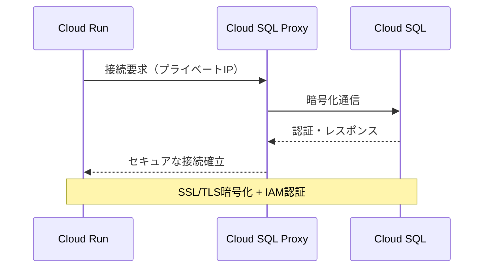
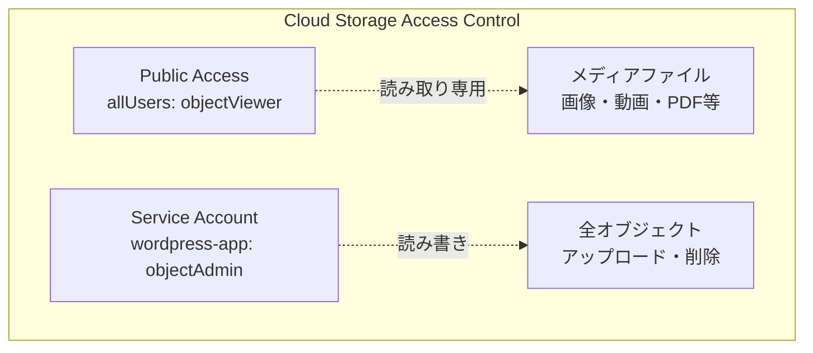
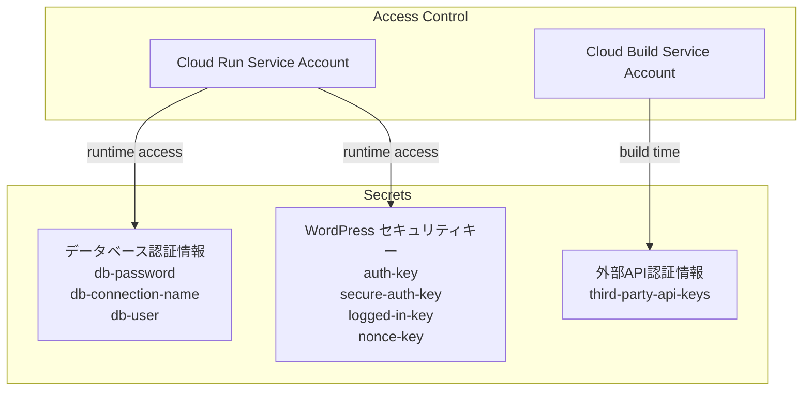
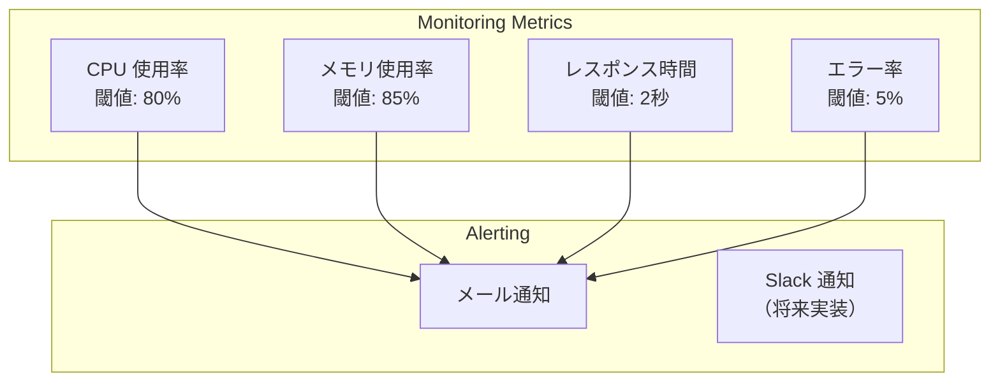
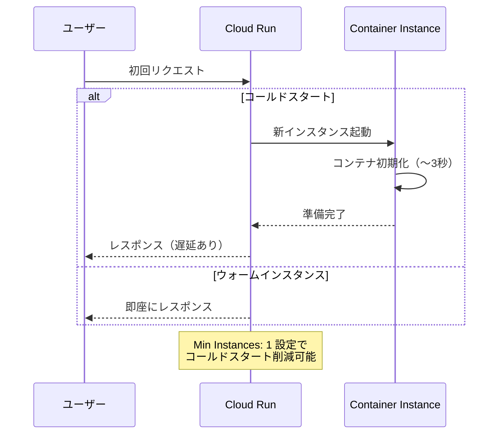
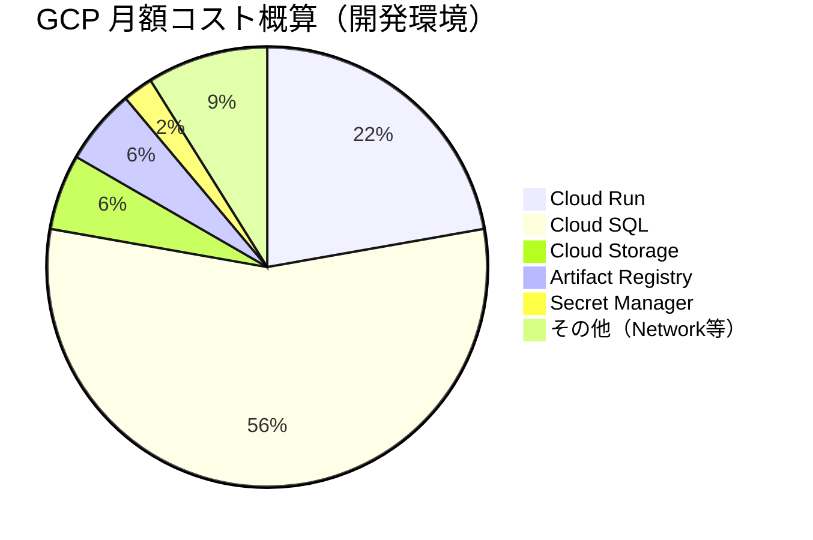
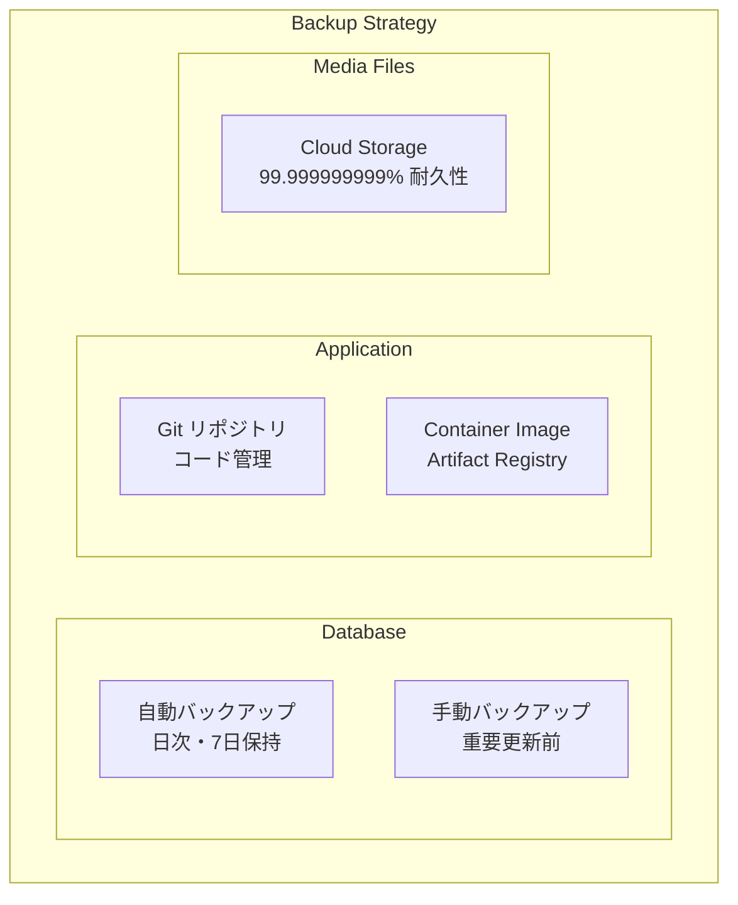

# Google Cloud インフラストラクチャ概要

## 概要

Revolution プロジェクトの Google Cloud Platform (GCP) インフラストラクチャは、WordPress を Headless CMS として Cloud Run 上で運用し、高可用性・スケーラビリティ・コスト効率を両立させた構成です。

## システム構成



## Google Cloud サービス詳細

### Cloud Run（コンテナ実行環境）

**概要**: サーバーレスコンテナプラットフォーム

**特徴**:
- **自動スケーリング**: 0〜1000インスタンス（トラフィックに応じて自動調整）
- **従量課金**: 実行時間のみ課金（アイドル時は無料）
- **高可用性**: 複数リージョンでの冗長化
- **第2世代**: 高速起動・大容量メモリ対応

**設定仕様**:
```yaml
Service Configuration:
  CPU: 1 vCPU
  Memory: 512Mi - 2Gi（負荷に応じて調整可能）
  Port: 8080
  Concurrency: 100（同時リクエスト数）
  Timeout: 300s（最大5分）
  
Auto Scaling:
  Min Instances: 0
  Max Instances: 10
  
Resource Allocation:
  CPU Allocation: Request時のみ
  Memory: 常時確保
```

### Cloud SQL（データベース）

**概要**: フルマネージド MySQL データベース

**アーキテクチャ選択の理由**:


**設定詳細**:
- **バージョン**: MySQL 8.0（8.4ではなく8.0を選択してコスト削減）
- **ティア**: 開発環境 `db-f1-micro`、本番環境 `db-n1-standard-1`
- **ストレージ**: SSD 20GB〜（自動拡張対応）
- **バックアップ**: 自動バックアップ（日次・7日間保持）
- **高可用性**: リージョナル永続ディスク使用

**セキュリティ設定**:


### Cloud Storage（オブジェクトストレージ）

**用途**: WordPress メディアファイルの永続化

**バケット構成**:
```
project-wordpress-media/
├── uploads/
│   ├── 2024/01/image1.jpg
│   ├── 2024/02/image2.png
│   └── ...
├── themes/
│   └── custom-assets/
└── plugins/
    └── plugin-assets/
```

**アクセス制御**:


**設定仕様**:
- **ストレージクラス**: Standard（頻繁アクセス用）
- **リージョン**: asia-northeast1（レイテンシ最適化）
- **CORS設定**: フロントエンドからの直接アクセス許可
- **ライフサイクル**: 古いファイルの自動アーカイブ（オプション）

### Secret Manager（機密情報管理）

**管理対象**:


### Artifact Registry（コンテナレジストリ）

**概要**: Docker イメージの保存・バージョン管理

**リポジトリ構成**:
```
asia-northeast1-docker.pkg.dev/
└── your-project/
    └── wordpress-repo/
        ├── wordpress:latest
        ├── wordpress:v1.0.0
        ├── wordpress:v1.1.0
        └── wordpress:develop
```

**ライフサイクル管理**:
- **保持ポリシー**: 最新10バージョン保持
- **自動削除**: 30日経過した古いイメージ削除
- **脆弱性スキャン**: 自動セキュリティスキャン有効

## ネットワーク・セキュリティ設計

### VPC・ファイアウォール設定

```mermaid
graph TB
    subgraph "VPC Network"
        subgraph "Public Subnet"
            CloudRun[Cloud Run<br/>0.0.0.0/0 からアクセス可能]
        end
        
        subgraph "Private Subnet"
            CloudSQL[Cloud SQL<br/>プライベートIP接続のみ]
            
        end
        
        subgraph "IAM Service Accounts"
            AppSA[wordpress-app@project.iam<br/>Cloud SQL Client<br/>Storage Object Admin]
            BuildSA[cloudbuild@project.iam<br/>Cloud Run Admin<br/>Artifact Registry Writer]
        end
    end
    
    CloudRun -.->|Private IP| CloudSQL
    CloudRun -.->|Service Account| AppSA
```

### セキュリティベストプラクティス

1. **最小権限の原則**
   - 各サービスアカウントは必要最小限の権限のみ
   - リソースレベルでの細かいアクセス制御

2. **データ暗号化**
   - 保存時暗号化: すべてのGCPサービスでデフォルト有効
   - 転送時暗号化: HTTPS/TLS強制

3. **ネットワーク分離**
   - Cloud SQL はプライベートIP接続のみ
   - Cloud Run からのアウトバウンド通信制限

## 監視・ロギング

### Cloud Monitoring 設定



### Cloud Logging

**ログ集約対象**:
- Cloud Run アプリケーションログ
- Cloud SQL 監査ログ
- Cloud Build ビルドログ
- セキュリティ関連イベント

## パフォーマンス最適化

### コールドスタート対策



### データベース最適化

- **接続プーリング**: 永続的DB接続の活用
- **クエリ最適化**: インデックス設計・クエリチューニング
- **読み取りレプリカ**: 将来の負荷分散対応

## コスト最適化戦略

### 現在のコスト構造



### コスト削減施策

1. **Cloud Run**
   - 開発環境: Min Instances = 0
   - 本番環境: 適切なインスタンス数設定

2. **Cloud SQL**
   - MySQL 8.0 選択（Enterprise Plus 回避）
   - 開発環境: 自動停止設定

3. **Cloud Storage**
   - ライフサイクルポリシー設定
   - 不要なファイルの定期削除

## 災害復旧・BCP

### バックアップ戦略



### 復旧手順（概要）

1. **データベース復旧**: Cloud SQL バックアップからの復元
2. **アプリケーション復旧**: Git + Docker イメージからの再デプロイ
3. **設定復旧**: Secret Manager からの認証情報復元

## 拡張性・将来計画

### 短期計画（3-6ヶ月）

- [ ] Cloud Monitoring アラート設定
- [ ] 自動スケーリング調整
- [ ] パフォーマンステスト実施

### 中期計画（6-12ヶ月）

- [ ] Multi-region 対応検討
- [ ] CDN (Cloud CDN) 導入
- [ ] データベース読み取りレプリカ

### 長期計画（1年以上）

- [ ] Kubernetes (GKE) 移行検討
- [ ] マイクロサービス化
- [ ] AI/ML サービス統合

## 運用・保守

### 定期メンテナンス

- **週次**: ログレビュー・パフォーマンス確認
- **月次**: コスト分析・セキュリティ監査
- **四半期**: インフラ設計見直し

### トラブルシューティング

主要な問題とその対処法は [Cloud Run デプロイガイド](../08-cicd/CD-cloud-run-docker-deploy.md) を参照してください。

## 関連ドキュメント

- [アーキテクチャ概要](../01-arch/ARCH-project-overview.md)
- [Cloud Run デプロイガイド](../08-cicd/CD-cloud-run-docker-deploy.md)
- [バックエンド開発ガイド](../04-backend/BE-docker-commands-troubleshoot.md)
