# Docker WordPress ライフサイクル詳解

## 概要

Revolution プロジェクトにおける WordPress の Docker 環境は、ローカル開発環境と本番環境（Cloud Run）で異なる起動プロセスを持ちます。

## ローカル環境の起動プロセス

### 1. 起動コマンドの流れ


### 2. ファイルの読み込み順序

```yaml
# docker-compose.yml が読み込む設定
services:
  wordpress:
    build: .                    # Dockerfile を使用
    env_file: .env             # 環境変数
    volumes:
      - ./wp-content:/var/www/html/wp-content  # ローカルマウント
    depends_on:
      - mysql                   # 依存関係
```

### 3. WordPress 設定の決定

```php
// wp-config.php の動作（ローカル）
$db_connection_name = getenv('DB_CONNECTION_NAME');  // 空

if (!empty($db_connection_name)) {
    // Cloud SQL（スキップ）
} else {
    // ローカル接続が選択される
    $db_host = getenv('DB_HOST') ?: 'mysql';  // 'mysql' コンテナ名
}
```

## プロダクション環境（Cloud Run）の起動プロセス

### 1. デプロイから起動までの流れ

```mermaid
sequenceDiagram
    participant Dev as 開発者
    participant GCB as Cloud Build
    participant Registry as Artifact Registry
    participant CloudRun as Cloud Run
    participant Container as Container Instance
    participant CloudSQL as Cloud SQL
    
    Dev->>GCB: gcloud builds submit
    GCB->>GCB: Dockerfile 読み込み
    GCB->>GCB: RUN setup-wordpress.sh
    GCB->>GCB: プラグインをイメージに含める
    GCB->>Registry: Push image
    
    Dev->>CloudRun: gcloud run deploy
    CloudRun->>Registry: Pull image
    CloudRun->>Container: Start container
    
    Container->>Container: cloud-run-entrypoint.sh
    Container->>Container: wordpress-init.sh
    Container->>Container: PORT環境変数チェック
    Container->>Container: Apache起動
    
    Container->>CloudSQL: DB接続（Cloud SQL Proxy経由）
    CloudSQL-->>Container: 接続確立
    
    Container-->>CloudRun: Ready to serve
```



### 2. 環境変数の注入タイミング


### 3. WordPress 設定の決定（本番）

```php
// wp-config.php の動作（Cloud Run）
$db_connection_name = getenv('DB_CONNECTION_NAME');  // 'project:region:instance'

if (!empty($db_connection_name)) {
    // Cloud SQL接続が選択される
    $db_host = 'localhost:/cloudsql/' . $db_connection_name;
} else {
    // ローカル接続（スキップ）
}
```

## 主要な違いの比較

| 項目 | ローカル環境 | プロダクション環境 |
|------|------------|----------------|
| **起動方法** | `docker-compose up` | `gcloud run deploy` |
| **DB接続** | MySQL コンテナ | Cloud SQL |
| **プラグイン** | Volume マウント | イメージに含める |
| **環境変数** | `.env` ファイル | Secret Manager |
| **ポート** | 8080（固定） | 8080（環境変数で変更可） |
| **永続化** | Volume | Cloud Storage |

## エントリーポイントスクリプトの詳細

### cloud-run-entrypoint.sh の役割

```bash
#!/bin/bash
# 1. wordpress-init.sh を実行（環境設定）
/usr/local/bin/wordpress-init.sh

# 2. WordPress 標準の docker-entrypoint.sh を実行
exec /usr/local/bin/docker-entrypoint.sh "$@"

# 3. CMD で指定された apache2-foreground を実行
```

### wordpress-init.sh の処理内容

```bash
# 1. 環境変数の確認
echo "PORT: ${PORT:-8080}"
echo "BUCKET_NAME: ${BUCKET_NAME:-not set}"

# 2. PORT が 8080 以外の場合、Apache設定を変更
if [ "$PORT" != "8080" ]; then
    sed -i "s/Listen 0.0.0.0:8080/Listen 0.0.0.0:$PORT/" /etc/apache2/ports.conf
    sed -i "s/:8080>/:$PORT>/" /etc/apache2/sites-available/000-default.conf
fi
```

## プラグインのライフサイクル

### ビルド時のプラグインインストール


### ローカル開発時のプラグイン管理


## トラブルシューティング

### ローカル環境でプラグインが見えない

```bash
# 1. Volume マウントの確認
docker-compose exec wordpress ls -la /var/www/html/wp-content/plugins/

# 2. 権限の確認
docker-compose exec wordpress chown -R www-data:www-data /var/www/html/wp-content/

# 3. setup-wordpress.sh の実行
docker-compose exec wordpress /tmp/setup-wordpress.sh
```

### Cloud Run でプラグインが動作しない

```bash
# 1. ビルドログの確認
gcloud builds list --limit=1

# 2. イメージ内容の確認
docker run --rm -it gcr.io/PROJECT_ID/wordpress:latest ls -la /var/www/html/wp-content/plugins/

# 3. 環境変数の確認
gcloud run services describe wordpress-backend --region=asia-northeast1 --format="value(spec.template.spec.containers[0].env[*])"
```

## ベストプラクティス

### 1. プラグイン管理の原則

- **無料プラグイン**: setup-wordpress.sh でダウンロード
- **有料プラグイン**: プライベートストレージから取得
- **カスタムプラグイン**: wp-content/mu-plugins に配置

### 2. 環境変数の管理

```yaml
# ローカル: .env ファイル
DB_HOST=mysql
DB_NAME=wordpress
DB_USER=root
DB_PASSWORD=password

# 本番: Secret Manager
gcloud secrets create db-password --data-file=-
gcloud run services update --set-secrets="DB_PASSWORD=db-password:latest"
```

### 3. デバッグモードの切り替え

```php
// wp-config.php
define('WP_DEBUG', getenv('WP_ENV') === 'development');
define('WP_DEBUG_LOG', getenv('WP_ENV') === 'development');
define('WP_DEBUG_DISPLAY', getenv('WP_ENV') === 'development');
```

## 関連ドキュメント

- [Docker コマンド集](./BE-docker-commands-troubleshoot.md)
- [Cloud Run デプロイガイド](../08-cicd/CD-cloud-run-docker-deploy.md)
- [アーキテクチャ概要](../01-arch/ARCH-project-overview.md)