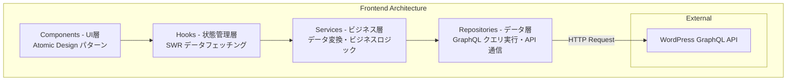

# Next.js Headless CMS フロントエンド開発ガイド

## 概要

Revolution プロジェクトのフロントエンドは、Next.js 14 App Router を採用し、WordPress の GraphQL API からコンテンツを取得する Headless CMS アーキテクチャで構築されています。

## 技術スタック詳細

### コアフレームワーク
- **Next.js 14.2.4**: App Router による最新のルーティング機構
- **React 18.3.1**: Server Components と Suspense による最適化
- **TypeScript 5.9.2**: 型安全な開発環境

### スタイリング・UI
- **Tailwind CSS 3.4.0**: ユーティリティファーストの CSS フレームワーク
- **Headless UI**: アクセシブルな UI コンポーネント
- **PostCSS**: CSS の自動最適化

### データ取得・状態管理
- **SWR**: クライアントサイドのデータフェッチング
- **GraphQL**: WordPress との効率的なデータ通信
- **React Context**: グローバル状態管理

## プロジェクト構造

```
apps/frontend/
├── app/                    # App Router ディレクトリ
│   ├── layout.tsx          # ルートレイアウト
│   ├── page.tsx            # ホームページ
│   ├── post/
│   │   └── [slug]/         # 投稿詳細（動的ルート）
│   │       └── page.tsx
│   ├── category/
│   │   └── [slug]/         # カテゴリーページ（動的ルート）
│   │       └── page.tsx
│   └── api/                # API ルート
│       └── hello/
│           └── route.ts
├── components/             # React コンポーネント
│   ├── atoms/              # 最小単位のコンポーネント
│   │   ├── image/
│   │   ├── label/
│   │   └── text/
│   ├── molecules/          # 複合コンポーネント
│   │   └── PostBox.tsx
│   ├── organisms/          # 機能単位のコンポーネント
│   │   ├── Header.tsx
│   │   └── Footer.tsx
│   └── templates/          # ページテンプレート
│       └── Layout.tsx
├── services/               # ビジネスロジック層
│   └── PostService.ts      # 投稿データ処理
├── repositories/           # データアクセス層
│   ├── PostRepository.ts   # GraphQL クエリ実行
│   └── RepositoryFactory.ts
├── hooks/                  # カスタムフック
│   └── swr/
│       ├── usePostListSwr.ts
│       └── usePostSwr.ts
├── types/                  # TypeScript 型定義
│   ├── PostType.ts
│   ├── CategoryType.ts
│   └── FeaturedImageType.ts
└── constants/              # 定数定義
    └── WpGraphQlConst.ts   # GraphQL クエリ定義
```

## アーキテクチャパターン

### レイヤードアーキテクチャ



### Atomic Design

コンポーネントは Atomic Design パターンに従って構成：

1. **Atoms**: ボタン、ラベル、画像など最小単位
2. **Molecules**: Atoms を組み合わせた小規模コンポーネント
3. **Organisms**: 機能を持つ大規模コンポーネント
4. **Templates**: ページレイアウト
5. **Pages**: 実際のページコンポーネント（app/ ディレクトリ）

## WordPress GraphQL 連携

### GraphQL エンドポイント設定

```typescript
// .env.local
NEXT_PUBLIC_WP_ENDPOINT=http://localhost:8080/graphql
ALLOWED_IMAGE_HOST=localhost
```

### クエリ定義例

```typescript
// constants/WpGraphQlConst.ts
export const POSTS_QUERY = `
  query GetPosts($first: Int!, $after: String) {
    posts(first: $first, after: $after) {
      pageInfo {
        hasNextPage
        endCursor
      }
      edges {
        node {
          id
          title
          slug
          excerpt
          date
          featuredImage {
            node {
              sourceUrl
              altText
            }
          }
          categories {
            edges {
              node {
                name
                slug
              }
            }
          }
        }
      }
    }
  }
`;
```

### データ取得パターン

#### サーバーコンポーネント（SSG/ISR）

```typescript
// app/post/[slug]/page.tsx
async function getPost(slug: string) {
  const response = await fetch(process.env.NEXT_PUBLIC_WP_ENDPOINT!, {
    method: 'POST',
    headers: { 'Content-Type': 'application/json' },
    body: JSON.stringify({
      query: POST_BY_SLUG_QUERY,
      variables: { slug }
    }),
    next: { revalidate: 3600 } // ISR: 1時間ごとに再検証
  });
  
  return response.json();
}
```

#### クライアントコンポーネント（SWR）

```typescript
// hooks/swr/usePostListSwr.ts
export const usePostListSwr = () => {
  const { data, error, isLoading } = useSWR(
    ['posts', { first: 10 }],
    () => PostService.fetchPosts({ first: 10 }),
    {
      revalidateOnFocus: false,
      revalidateOnReconnect: false,
      dedupingInterval: 60000 // 1分間キャッシュ
    }
  );
  
  return { posts: data, error, isLoading };
};
```

## パフォーマンス最適化

### 画像最適化

```tsx
// components/atoms/image/CommImage.tsx
import Image from 'next/image';

export const CommImage = ({ src, alt, width, height }) => (
  <Image
    src={src}
    alt={alt}
    width={width}
    height={height}
    loading="lazy"
    placeholder="blur"
    blurDataURL={generateBlurDataURL()}
  />
);
```

### バンドル最適化

```javascript
// next.config.mjs
export default {
  swcMinify: true,
  compiler: {
    removeConsole: process.env.NODE_ENV === 'production'
  },
  experimental: {
    optimizeCss: true
  }
};
```

### キャッシュ戦略

1. **静的生成（SSG）**: ビルド時にページ生成
2. **ISR（増分静的再生成）**: 定期的な再生成
3. **SWR キャッシュ**: クライアントサイドキャッシュ
4. **CDN キャッシュ**: CloudFlare による配信最適化

## 開発ワークフロー

### 開発サーバー起動

```bash
# ルートディレクトリから
pnpm dev:frontend

# または apps/frontend から
pnpm dev
```

### ビルド・本番起動

```bash
# ビルド
pnpm build

# 本番サーバー起動
pnpm start
```

### 型チェック・Lint

```bash
# TypeScript 型チェック
pnpm type-check

# ESLint
pnpm lint
```

## 環境変数管理

### 必須環境変数

```bash
# .env.local
NEXT_PUBLIC_WP_ENDPOINT=http://localhost:8080/graphql  # GraphQL エンドポイント
ALLOWED_IMAGE_HOST=localhost                            # 画像最適化用ホスト
```

### 環境別設定

- **開発環境**: `.env.local`
- **本番環境**: Vercel のダッシュボードで設定

## デバッグ・トラブルシューティング

### よくある問題と解決策

#### 1. GraphQL 接続エラー

```typescript
// エラー処理の実装
try {
  const data = await fetchGraphQL(query, variables);
  if (data.errors) {
    console.error('GraphQL errors:', data.errors);
    // エラーハンドリング
  }
} catch (error) {
  console.error('Network error:', error);
  // フォールバック処理
}
```

#### 2. 画像表示エラー

```javascript
// next.config.mjs で画像ドメインを許可
export default {
  images: {
    remotePatterns: [
      {
        protocol: 'http',
        hostname: process.env.ALLOWED_IMAGE_HOST
      }
    ]
  }
};
```

#### 3. ビルドエラー

```bash
# キャッシュクリア
rm -rf .next
pnpm build
```

### デバッグツール

1. **React Developer Tools**: コンポーネント階層の確認
2. **Next.js Dev Overlay**: エラー表示とスタックトレース
3. **GraphQL Playground**: http://localhost:8080/graphql でクエリテスト

## ベストプラクティス

### コンポーネント設計

1. **単一責任の原則**: 1コンポーネント1機能
2. **Props の型定義**: TypeScript による型安全性
3. **メモ化**: React.memo, useMemo, useCallback の適切な使用

### データフェッチング

1. **適切な手法の選択**:
   - 静的データ → SSG
   - 頻繁に更新 → ISR
   - ユーザー固有 → CSR (SWR)

2. **エラーハンドリング**: 必ずエラー状態を処理

3. **ローディング状態**: Suspense または loading.tsx の活用

### コード品質

1. **型定義の徹底**: any の使用禁止
2. **ESLint ルール遵守**: コミット前に lint 実行
3. **コンポーネントテスト**: 重要な機能にはテスト追加

## セキュリティ考慮事項

### API エンドポイント保護

```typescript
// API ルートでの認証チェック例
export async function GET(request: Request) {
  const token = request.headers.get('authorization');
  
  if (!validateToken(token)) {
    return new Response('Unauthorized', { status: 401 });
  }
  
  // 処理続行
}
```

### XSS 対策

- React の自動エスケープ機能を活用
- dangerouslySetInnerHTML の使用を避ける
- ユーザー入力の検証とサニタイズ

### 環境変数の管理

- `NEXT_PUBLIC_` プレフィックスはクライアントに露出
- 機密情報はサーバーサイドのみで使用
- `.env.local` は git ignore に追加

## 関連ドキュメント

- [アーキテクチャ概要](../01-arch/ARCH-project-overview.md)
- [モノレポ統合ガイド](../02-mono/MONO-integration-guide-v2.md)
- [バックエンドプラグイン管理](../04-backend/BE-plugins-management.md)
- [ビルドツール戦略](../07-build/BUILD-turbo-vs-make-strategy.md)
