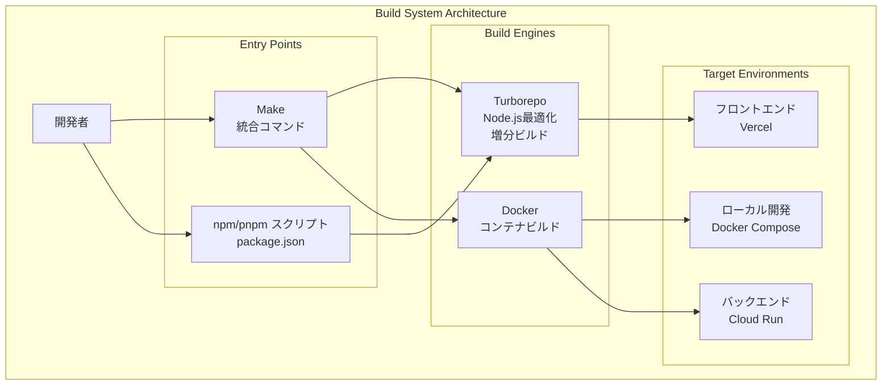
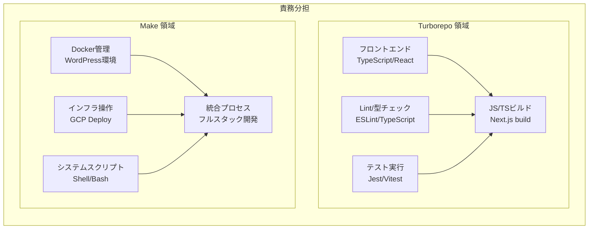
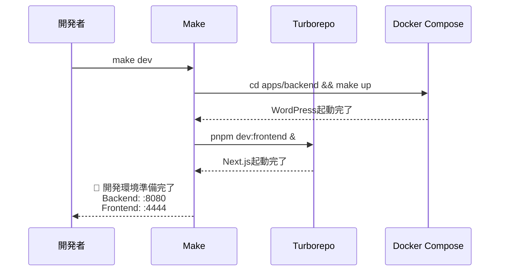
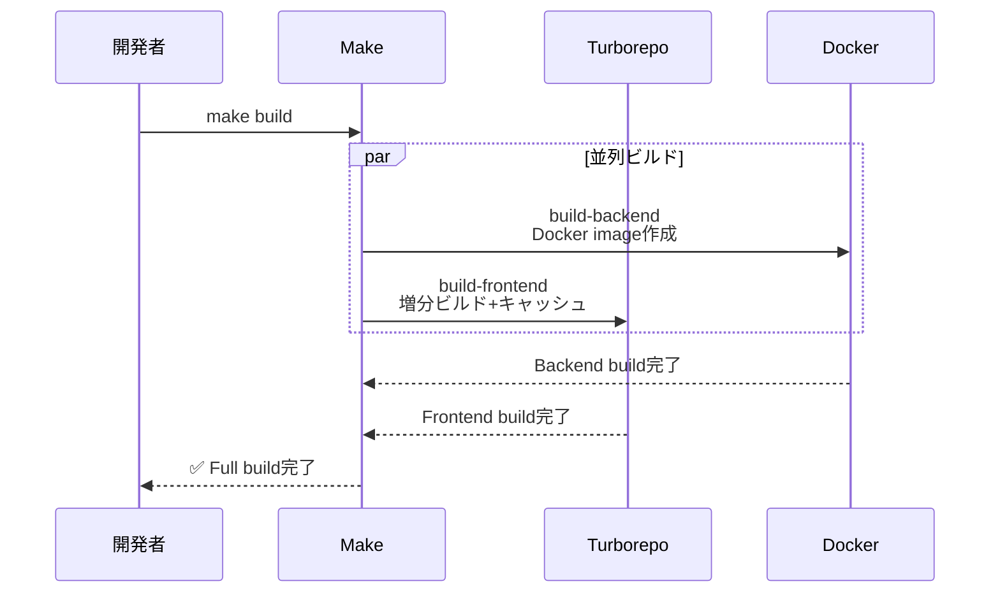
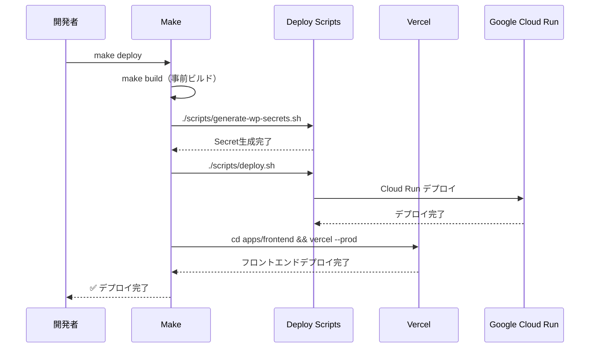
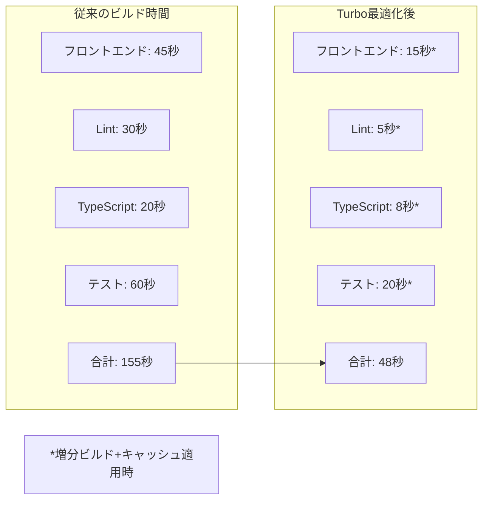

# ビルドシステム概要

## 概要

Revolution プロジェクトは **Turborepo + Make** の統合によるハイブリッドビルドシステムを採用し、モノレポ環境における効率的な開発・ビルド・デプロイメントを実現しています。

## アーキテクチャ



## 技術選択の理由

### なぜ Turborepo + Make の併用？



### 各ツールの強み

1. **Turborepo**
   - **増分ビルド**: 変更されたファイルのみをビルド
   - **並列実行**: 依存関係を考慮した並列タスク実行
   - **キャッシュ**: ローカル・リモートキャッシュによる高速化
   - **Node.js最適化**: npm/pnpm/yarn との緊密な連携

2. **Make**
   - **システム統合**: Docker、インフラコマンドの統合管理
   - **プラットフォーム独立**: Unix系OSでの標準的なビルドツール
   - **簡潔な依存関係**: ターゲット間の明確な依存定義
   - **シェル統合**: bashスクリプトとの自然な連携

## ビルド設定詳細

### Turborepo 設定（turbo.json）

```json
{
  "$schema": "https://turbo.build/schema.json",
  "globalDependencies": ["**/.env*"],
  "tasks": {
    "dev": {
      "cache": false,
      "persistent": true
    },
    "build": {
      "dependsOn": ["^build"],
      "outputs": [".next/**", "!.next/cache/**", "dist/**", "build/**"]
    },
    "lint": {
      "outputs": ["eslint-report.json"]
    },
    "type-check": {
      "dependsOn": ["^build"],
      "outputs": []
    },
    "test": {
      "dependsOn": ["^build"],
      "outputs": ["coverage/**"]
    },
    "clean": {
      "cache": false
    }
  }
}
```

**重要な設定項目**:
- `globalDependencies`: 環境変数変更時のキャッシュ無効化
- `dependsOn`: ワークスペース間の依存関係定義
- `outputs`: ビルド成果物のキャッシュ対象指定
- `persistent`: 開発サーバーなどの常駐プロセス対応

### Make統合設定（Makefile）

```makefile
# Revolution Project - Root Makefile
# Turbo + Make 統合管理

.PHONY: help dev build deploy clean setup test

# 統合開発環境（メインコマンド）
dev: backend frontend-background
	@echo "🎉 Revolution Development Environment Ready!"

# バックエンド起動（Docker管理）
backend:
	@echo "🐳 Starting WordPress backend (Docker)..."
	cd apps/backend && make up

# フロントエンドをバックグラウンドで起動（Turbo委譲）
frontend-background:
	@echo "⚛️  Starting Next.js frontend (Turbo)..."
	pnpm dev:frontend &

# Turboを活用したビルド
build: build-backend build-frontend
	@echo "✅ Full Revolution build completed!"

build-frontend:
	@echo "🔨 Building frontend (Turbo optimized)..."
	pnpm build:frontend
```

## ワークフロー詳細

### 1. 開発ワークフロー



### 2. ビルドワークフロー



### 3. デプロイワークフロー



## パフォーマンス最適化

### Turborepo の最適化機能

1. **増分ビルド**
   ```bash
   # 変更されたファイルのみをビルド
   pnpm build  # Turboが自動的に差分検出
   ```

2. **並列実行**
   ```bash
   # 複数ワークスペースの並列処理
   pnpm lint    # 全ワークスペースで並列実行
   pnpm test    # 依存関係を考慮した順序で並列実行
   ```

3. **キャッシュ活用**
   ```bash
   # ローカルキャッシュ
   .turbo/cache/  # ビルド結果のキャッシュ
   
   # リモートキャッシュ（本番環境）
   turbo build --cache-dir=.turbo/cache
   ```

### ビルド時間最適化実績



## 環境別ビルド戦略

### 開発環境（Local）

```bash
# 高速起動重視
make dev
├── Backend: Docker Compose（素早い立ち上げ）
└── Frontend: Turbo dev（HMR対応）

# コード品質チェック
pnpm lint        # ESLint（Turbo並列実行）
pnpm type-check  # TypeScript（増分チェック）
```

### ステージング環境

```bash
# 本番相当のビルド
make build
├── Backend: Docker production build
└── Frontend: Next.js optimized build

# デプロイ準備
./scripts/deploy.sh --env=staging
```

### 本番環境

```bash
# 最適化ビルド
make deploy
├── 事前ビルド: make build
├── シークレット生成: generate-wp-secrets.sh
├── バックエンド: Cloud Run デプロイ
└── フロントエンド: Vercel デプロイ
```

## コマンド一覧

### 主要コマンド

| コマンド | 説明 | 実装 |
|---------|------|------|
| `make dev` | フルスタック開発環境起動 | Make + Docker + Turbo |
| `make build` | 全コンポーネントビルド | Make → Turbo + Docker |
| `make deploy` | 本番デプロイ | Make → Scripts + Vercel |
| `pnpm lint` | コード品質チェック | Turbo 並列実行 |
| `pnpm type-check` | TypeScript型チェック | Turbo 増分実行 |

### 個別環境コマンド

| コマンド | 説明 | 用途 |
|---------|------|------|
| `pnpm dev:frontend` | フロントエンドのみ起動 | フロント開発集中時 |
| `make backend` | バックエンドのみ起動 | WP設定・プラグイン開発 |
| `make clean` | 環境クリーンアップ | トラブル解決時 |
| `make status` | 環境状態確認 | デバッグ・確認時 |

## CI/CD統合

### GitHub Actions との連携

```yaml
name: Build and Deploy
on:
  push:
    branches: [main]

jobs:
  build:
    runs-on: ubuntu-latest
    steps:
      - uses: actions/checkout@v3
      
      # Turbo キャッシュ活用
      - name: Setup Turbo cache
        uses: actions/cache@v3
        with:
          path: .turbo
          key: turbo-${{ runner.os }}-${{ github.sha }}
          restore-keys: turbo-${{ runner.os }}-
      
      # 並列ビルド実行
      - name: Build all workspaces
        run: pnpm build  # Turbo が並列実行
      
      # 品質チェック
      - name: Lint and type check
        run: |
          pnpm lint        # 並列 Lint
          pnpm type-check  # 増分型チェック
      
      # テスト実行
      - name: Run tests
        run: pnpm test  # Turbo 並列テスト実行
```

### キャッシュ戦略

1. **ローカル開発**
   - `.turbo/cache/`: ローカルキャッシュディレクトリ
   - 増分ビルドによる高速化

2. **CI/CD環境**
   - GitHub Actions Cache: ビルドキャッシュ共有
   - Vercel: フロントエンドビルドキャッシュ
   - Cloud Build: Dockerレイヤーキャッシュ

## トラブルシューティング

### よくある問題と解決策

#### 1. Turbo キャッシュエラー

```bash
# キャッシュクリア
pnpm turbo run clean
rm -rf .turbo/cache

# 再ビルド
pnpm build
```

#### 2. ワークスペース依存関係エラー

```bash
# 依存関係再インストール
pnpm fresh  # make clean && pnpm install

# Turbo設定確認
pnpm turbo:version
```

#### 3. Docker ビルドエラー

```bash
# Docker環境クリーンアップ
make clean

# 再ビルド
make dev
```

### デバッグコマンド

```bash
# 環境状態確認
make status

# ログ確認
make logs  # Backend logs

# Turbo設定確認
pnpm turbo run build --dry  # 実行計画表示
```

## 将来の拡張計画

### 短期計画（3-6ヶ月）

- [ ] **リモートキャッシュ**: Turbo Remote Cache 導入
- [ ] **並列テスト**: Jest 並列実行最適化
- [ ] **ビルド分析**: Bundle analyzer 統合

### 中期計画（6-12ヶ月）

- [ ] **マイクロフロントエンド**: Module Federation 対応
- [ ] **E2Eテスト統合**: Playwright + Turbo 連携
- [ ] **パフォーマンス計測**: Core Web Vitals 監視

### 長期計画（1年以上）

- [ ] **Monorepo拡張**: 複数サービス対応
- [ ] **Build Pipeline**: Advanced CI/CD 最適化
- [ ] **Developer Experience**: VS Code拡張・デバッグ統合

## 関連ドキュメント

- [アーキテクチャ概要](../01-arch/ARCH-project-overview.md)
- [モノレポ運用](../02-mono/MONO-overview.md)
- [CI/CD パイプライン](../08-cicd/CD-github-actions.md)
- [スクリプトアーキテクチャ](../06-ops/OPS-scripts-architecture.md)