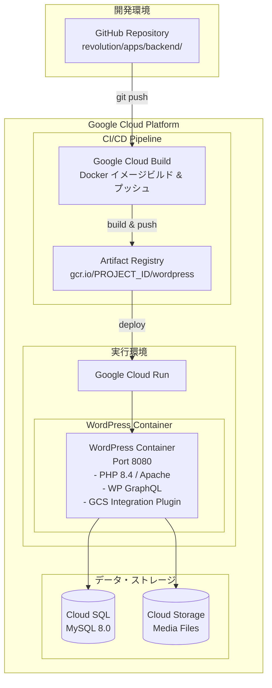

# Cloud Run Docker デプロイガイド

## 概要

Revolution プロジェクトの WordPress バックエンドを Google Cloud Run にデプロイするための包括的なガイドです。Docker コンテナ化された WordPress を Cloud Run で運用し、Cloud SQL と Cloud Storage と連携させます。

## アーキテクチャ



## 前提条件

### 必要なツール

```bash
# Google Cloud SDK
gcloud --version  # 400.0.0 以上

# Docker
docker --version  # 20.10.0 以上

# 認証設定
gcloud auth login
gcloud config set project YOUR_PROJECT_ID
```

### 必要な GCP サービス

1. **Cloud Run API**: 有効化必須
2. **Cloud Build API**: Docker イメージビルド用
3. **Container Registry API**: イメージ保存用
4. **Cloud SQL Admin API**: データベース接続用
5. **Cloud Storage API**: メディアファイル保存用
6. **Secret Manager API**: 認証情報管理用

```bash
# API 有効化コマンド
gcloud services enable \
  run.googleapis.com \
  cloudbuild.googleapis.com \
  containerregistry.googleapis.com \
  sqladmin.googleapis.com \
  storage.googleapis.com \
  secretmanager.googleapis.com
```

## デプロイ手順

### 1. 環境変数設定

```bash
# プロジェクト設定
export PROJECT_ID="your-project-id"
export REGION="asia-northeast1"
export SERVICE_NAME="wordpress-backend"

# データベース設定
export DB_INSTANCE="wordpress-mysql"
export DB_NAME="wordpress"
export DB_USER="wp_user"

# ストレージ設定
export BUCKET_NAME="${PROJECT_ID}-wordpress-media"
```

### 2. Cloud SQL セットアップ

```bash
# Cloud SQL インスタンス作成
gcloud sql instances create ${DB_INSTANCE} \
  --database-version=MYSQL_8_0 \
  --tier=db-f1-micro \
  --region=${REGION} \
  --network=default \
  --no-assign-ip

# データベース作成
gcloud sql databases create ${DB_NAME} \
  --instance=${DB_INSTANCE}

# ユーザー作成
gcloud sql users create ${DB_USER} \
  --instance=${DB_INSTANCE} \
  --password=SECURE_PASSWORD
```

### 3. Cloud Storage バケット作成

```bash
# バケット作成
gsutil mb -p ${PROJECT_ID} \
  -c STANDARD \
  -l ${REGION} \
  gs://${BUCKET_NAME}/

# 公開アクセス設定（メディアファイル用）
gsutil iam ch allUsers:objectViewer gs://${BUCKET_NAME}

# CORS 設定
cat > cors.json << EOF
[
  {
    "origin": ["*"],
    "method": ["GET", "HEAD"],
    "responseHeader": ["Content-Type"],
    "maxAgeSeconds": 3600
  }
]
EOF

gsutil cors set cors.json gs://${BUCKET_NAME}
```

### 4. Secret Manager 設定

```bash
# データベースパスワード保存
echo -n "SECURE_PASSWORD" | gcloud secrets create db-password \
  --data-file=- \
  --replication-policy="automatic"

# WordPress 塩鍵生成・保存
php -r 'echo base64_encode(random_bytes(64));' | \
  gcloud secrets create wp-auth-key --data-file=-
```

### 5. Docker イメージビルド

```bash
cd apps/backend

# ローカルビルド（テスト用）
docker build -t wordpress-cloudrun:latest .

# Cloud Build でビルド
gcloud builds submit \
  --tag gcr.io/${PROJECT_ID}/${SERVICE_NAME}:latest \
  --timeout=30m
```

### 6. Cloud Run デプロイ

```bash
# デプロイ実行
gcloud run deploy ${SERVICE_NAME} \
  --image gcr.io/${PROJECT_ID}/${SERVICE_NAME}:latest \
  --platform managed \
  --region ${REGION} \
  --port 8080 \
  --memory 512Mi \
  --cpu 1 \
  --min-instances 0 \
  --max-instances 10 \
  --allow-unauthenticated \
  --add-cloudsql-instances ${PROJECT_ID}:${REGION}:${DB_INSTANCE} \
  --set-env-vars="DB_HOST=localhost" \
  --set-env-vars="DB_NAME=${DB_NAME}" \
  --set-env-vars="DB_USER=${DB_USER}" \
  --set-env-vars="BUCKET_NAME=${BUCKET_NAME}" \
  --set-secrets="DB_PASSWORD=db-password:latest" \
  --set-secrets="AUTH_KEY=wp-auth-key:latest"
```

## デプロイスクリプト

### 完全自動化スクリプト（apps/backend/scripts/deploy.sh）

```bash
#!/bin/bash
set -euo pipefail

# 設定読み込み
source .env.production

# カラー出力
RED='\033[0;31m'
GREEN='\033[0;32m'
YELLOW='\033[1;33m'
NC='\033[0m'

echo -e "${GREEN}🚀 Starting Cloud Run Deployment...${NC}"

# 1. Docker イメージビルド
echo -e "${YELLOW}Building Docker image...${NC}"
gcloud builds submit \
  --tag gcr.io/${PROJECT_ID}/${SERVICE_NAME}:${VERSION:-latest} \
  --timeout=30m \
  --quiet

# 2. Cloud Run デプロイ
echo -e "${YELLOW}Deploying to Cloud Run...${NC}"
gcloud run deploy ${SERVICE_NAME} \
  --image gcr.io/${PROJECT_ID}/${SERVICE_NAME}:${VERSION:-latest} \
  --platform managed \
  --region ${REGION} \
  --service-account ${SERVICE_ACCOUNT} \
  --add-cloudsql-instances ${CLOUDSQL_CONNECTION} \
  --update-env-vars-file=.env.cloudrun.yaml \
  --quiet

# 3. URL 取得
SERVICE_URL=$(gcloud run services describe ${SERVICE_NAME} \
  --platform managed \
  --region ${REGION} \
  --format 'value(status.url)')

echo -e "${GREEN}✅ Deployment successful!${NC}"
echo -e "${GREEN}Service URL: ${SERVICE_URL}${NC}"
```

## トラブルシューティング

### よくあるエラーと解決策

#### 1. ポート設定エラー

```
ERROR: Container failed to start. Failed to start and then listen on the port defined by the PORT environment variable.
```

**解決策**:
```dockerfile
# Dockerfile で PORT 環境変数を使用
ENV PORT 8080
EXPOSE ${PORT}

# Apache 設定で PORT を参照
RUN sed -i 's/80/${PORT}/g' /etc/apache2/sites-available/000-default.conf
```

#### 2. Cloud SQL 接続エラー

```
Error establishing a database connection
```

**解決策**:
```php
// wp-config.php での接続設定
if (getenv('DB_CONNECTION_NAME')) {
    // Cloud Run 環境
    define('DB_HOST', 'localhost:/cloudsql/' . getenv('DB_CONNECTION_NAME'));
} else {
    // ローカル環境
    define('DB_HOST', getenv('DB_HOST') ?: 'mysql');
}
```

#### 3. メモリ不足エラー

```
Memory limit exceeded
```

**解決策**:
```bash
# メモリ増設
gcloud run services update ${SERVICE_NAME} \
  --memory 1Gi \
  --region ${REGION}
```

#### 4. タイムアウトエラー

```
Request timeout
```

**解決策**:
```bash
# タイムアウト延長（最大60分）
gcloud run services update ${SERVICE_NAME} \
  --timeout 3600 \
  --region ${REGION}
```

### デバッグ方法

#### ログ確認

```bash
# リアルタイムログ
gcloud beta run services logs tail ${SERVICE_NAME} \
  --region ${REGION}

# 過去のログ
gcloud logging read "resource.type=cloud_run_revision \
  AND resource.labels.service_name=${SERVICE_NAME}" \
  --limit 50 \
  --format json
```

#### コンテナへの SSH

```bash
# Cloud Shell から接続
gcloud run services proxy ${SERVICE_NAME} \
  --region ${REGION} \
  --port 8080
```

#### ヘルスチェック

```bash
# サービス状態確認
curl -I https://${SERVICE_URL}/health.php

# GraphQL エンドポイント確認
curl -X POST https://${SERVICE_URL}/graphql \
  -H "Content-Type: application/json" \
  -d '{"query": "{ __typename }"}'
```

## パフォーマンス最適化

### 1. コールドスタート対策

```yaml
# 最小インスタンス設定
spec:
  template:
    metadata:
      annotations:
        autoscaling.knative.dev/minScale: "1"
```

### 2. キャッシュ設定

```php
// PHP OPcache 最適化
opcache.enable=1
opcache.memory_consumption=128
opcache.max_accelerated_files=10000
opcache.revalidate_freq=0
```

### 3. データベース接続プール

```php
// 永続的接続の使用
define('DB_PERSISTENT', true);
define('DB_POOL_SIZE', 5);
```

## セキュリティ設定

### 1. IAM 設定

```bash
# サービスアカウント作成
gcloud iam service-accounts create wordpress-sa \
  --display-name="WordPress Service Account"

# 必要な権限付与
gcloud projects add-iam-policy-binding ${PROJECT_ID} \
  --member="serviceAccount:wordpress-sa@${PROJECT_ID}.iam.gserviceaccount.com" \
  --role="roles/cloudsql.client"

gcloud projects add-iam-policy-binding ${PROJECT_ID} \
  --member="serviceAccount:wordpress-sa@${PROJECT_ID}.iam.gserviceaccount.com" \
  --role="roles/storage.objectAdmin"
```

### 2. ネットワーク設定

```bash
# VPC コネクタ作成（プライベート接続用）
gcloud compute networks vpc-access connectors create wordpress-connector \
  --region=${REGION} \
  --subnet=default \
  --subnet-project=${PROJECT_ID} \
  --min-instances=2 \
  --max-instances=10
```

### 3. 環境変数の暗号化

```yaml
# .env.cloudrun.yaml
DB_HOST: /cloudsql/PROJECT:REGION:INSTANCE
DB_NAME: wordpress
BUCKET_NAME: PROJECT-wordpress-media
WP_DEBUG: false
WP_DEBUG_LOG: false
WP_DEBUG_DISPLAY: false
```

## モニタリング

### Cloud Monitoring 設定

```bash
# アラート作成
gcloud alpha monitoring policies create \
  --notification-channels=${CHANNEL_ID} \
  --display-name="Cloud Run High Latency" \
  --condition-display-name="Request latency > 2s" \
  --condition-threshold-value=2000 \
  --condition-threshold-duration=60s
```

### ダッシュボード設定

```yaml
# monitoring-dashboard.yaml
displayName: WordPress Cloud Run Dashboard
dashboardFilters:
  - filterType: RESOURCE_LABEL
    labelKey: service_name
    templateVariable: SERVICE_NAME
widgets:
  - title: Request Count
    xyChart:
      dataSets:
        - timeSeriesQuery:
            timeSeriesFilter:
              filter: metric.type="run.googleapis.com/request_count"
  - title: Request Latency
    xyChart:
      dataSets:
        - timeSeriesQuery:
            timeSeriesFilter:
              filter: metric.type="run.googleapis.com/request_latencies"
```

## CI/CD 統合

### GitHub Actions 連携

```yaml
# .github/workflows/deploy.yml
name: Deploy to Cloud Run

on:
  push:
    branches: [main]
    paths:
      - 'apps/backend/**'

jobs:
  deploy:
    runs-on: ubuntu-latest
    steps:
      - uses: actions/checkout@v3
      
      - id: auth
        uses: google-github-actions/auth@v1
        with:
          credentials_json: ${{ secrets.GCP_SA_KEY }}
      
      - name: Set up Cloud SDK
        uses: google-github-actions/setup-gcloud@v1
      
      - name: Deploy
        run: |
          cd apps/backend
          ./scripts/deploy.sh
```

## コスト最適化

### 1. インスタンス設定

```bash
# 開発環境の最適化
gcloud run services update ${SERVICE_NAME}-dev \
  --min-instances=0 \
  --max-instances=2 \
  --memory=256Mi \
  --cpu=0.5
```

### 2. Cloud SQL 設定

```bash
# 開発環境は自動停止設定
gcloud sql instances patch ${DB_INSTANCE}-dev \
  --activation-policy=ALWAYS \
  --tier=db-f1-micro
```

### 3. ストレージライフサイクル

```json
{
  "lifecycle": {
    "rule": [
      {
        "action": {"type": "Delete"},
        "condition": {
          "age": 30,
          "matchesPrefix": ["tmp/"]
        }
      }
    ]
  }
}
```

## バックアップ・リカバリ

### データベースバックアップ

```bash
# 自動バックアップ設定
gcloud sql instances patch ${DB_INSTANCE} \
  --backup-start-time=03:00 \
  --backup-location=${REGION}

# 手動バックアップ
gcloud sql backups create \
  --instance=${DB_INSTANCE} \
  --description="Manual backup $(date +%Y%m%d)"
```

### リストア手順

```bash
# バックアップからリストア
gcloud sql backups restore ${BACKUP_ID} \
  --restore-instance=${DB_INSTANCE} \
  --backup-instance=${DB_INSTANCE}
```

## 関連ドキュメント

- [アーキテクチャ概要](../01-arch/ARCH-project-overview.md)
- [Docker コマンドガイド](../04-backend/BE-docker-commands-troubleshoot.md)
- [スクリプトアーキテクチャ](../06-ops/OPS-scripts-architecture.md)
- [GitHub Actions CI/CD](./CD-github-actions.md)
