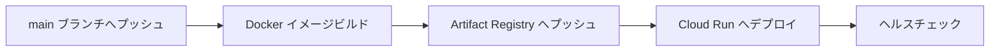

# CI/CD: AI Writer Cloud Run 自動デプロイ

> Revolution 現行版の **AI Writer** を GitHub Actions から Google Cloud Run へ自動デプロイするためのドキュメント。
> WordPress 時代の Cloud Run デプロイ手順は [`CICD-cloud-run-docker-deploy.md`](./CICD-cloud-run-docker-deploy.md) に残されています（PR #117 で運用終了）。

## ワークフロー概要



**ワークフローファイル**: `.github/workflows/deploy-ai-writer.yml`

## 技術スタック

| 項目 | 説明 |
|------|------|
| **コンテナレジストリ** | Google Cloud Artifact Registry |
| **デプロイ先** | Google Cloud Run（サーバーレスコンテナ） |
| **認証方式** | Workload Identity Federation（キーレス認証） |
| **ヘルスチェック** | `/api/health` エンドポイントで自動検証 |

## Workload Identity Federation (WIF)

GitHub Actions は WIF を使用して**キーレス認証**で GCP に接続します。サービスアカウント鍵を GitHub Secrets に保存しないため、鍵漏洩リスクを排除できます。

### 必要な GitHub Secrets

名前のみ記載（値は非公開）:

| Secret 名 | 説明 |
|-----------|------|
| `GCP_PROJECT_ID` | GCP プロジェクト ID |
| `GCP_REGION` | デプロイリージョン |
| `GAR_REPOSITORY` | Artifact Registry リポジトリ名 |
| `CLOUD_RUN_SERVICE_NAME` | Cloud Run サービス名 |
| `WIF_PROVIDER` | Workload Identity Federation プロバイダー |
| `WIF_SERVICE_ACCOUNT` | WIF サービスアカウント |

## ヘルスチェック仕様

デプロイ後、ワークフローは `/api/health` エンドポイントを叩いて以下を自動検証します:

- Firebase 接続確認
- Secrets Manager アクセス確認
- AI プロバイダー（Claude / Gemini / OpenAI）接続確認

ヘルスチェックが失敗した場合、デプロイはロールバックせず Cloud Run の前バージョンが引き続き稼働します（Cloud Run のトラフィック制御に従う）。

## フロントエンド（Vercel）

フロントエンドアプリは Vercel から個別にデプロイします:

```bash
cd apps/frontend
vercel --prod

# またはルートから
pnpm deploy:frontend
```

**環境変数**: Vercel Dashboard で設定。

## 参照

- [Google Cloud Workload Identity Federation](https://cloud.google.com/iam/docs/workload-identity-federation)
- [現行版 技術スタック](../01-arch/ARCH-current-stack.md)
- [MDX パイプライン詳細](../01-arch/ARCH-mdx-pipeline.md)
