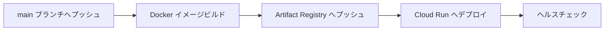

# CI/CD: AI Writer Cloud Run 自動デプロイ

> Revolution 現行版の **AI Writer** を GitHub Actions から Google Cloud Run へ自動デプロイするためのドキュメント。
> WordPress 時代の Cloud Run デプロイ手順は [`CICD-cloud-run-docker-deploy.md`](./CICD-cloud-run-docker-deploy.md) に残されています（PR #117 で運用終了）。

## ワークフロー概要



**ワークフローファイル**: `.github/workflows/deploy-ai-writer.yml`

## 技術スタック

| 項目 | 説明 |
|------|------|
| **コンテナレジストリ** | Google Cloud Artifact Registry |
| **デプロイ先** | Google Cloud Run（サーバーレスコンテナ） |
| **認証方式** | Workload Identity Federation（キーレス認証） |
| **ヘルスチェック** | `/api/health` エンドポイントで自動検証 |

## Workload Identity Federation (WIF)

GitHub Actions は WIF を使用して**キーレス認証**で GCP に接続します。サービスアカウント鍵を GitHub Secrets に保存しないため、鍵漏洩リスクを排除できます。

### 必要な GitHub Secrets

名前のみ記載（値は非公開）:

| Secret 名 | 説明 |
|-----------|------|
| `GCP_PROJECT_ID` | GCP プロジェクト ID |
| `GCP_REGION` | デプロイリージョン |
| `GAR_REPOSITORY` | Artifact Registry リポジトリ名 |
| `CLOUD_RUN_SERVICE_NAME` | Cloud Run サービス名 |
| `WIF_PROVIDER` | Workload Identity Federation プロバイダー |
| `WIF_SERVICE_ACCOUNT` | WIF サービスアカウント |

## ヘルスチェック仕様

デプロイ後、ワークフローは 30 秒待機してから `/api/health` エンドポイントを 1 回 curl し、HTTP 200 が返るかどうかだけを判定します（[`.github/workflows/deploy-ai-writer.yml`](../../.github/workflows/deploy-ai-writer.yml) の "Health check" ステップ）。

`/api/health` の実装（[`apps/ai-writer/app/api/health/route.ts`](../../apps/ai-writer/app/api/health/route.ts)）が実際に検証しているのは以下のみで、いずれも **環境変数の存在確認** であり外部サービスへの実接続はしていません:

- **Firebase 設定**: `NEXT_PUBLIC_FIREBASE_*` 6 種の env var が存在するか（ビルド時に埋め込まれる値のため、runtime での欠落は許容）
- **必須シークレット**: `ALLOWED_EMAILS` / `GITHUB_PAT` / `GITHUB_OWNER` / `GITHUB_REPO`、および `GOOGLE_APPLICATION_CREDENTIALS_JSON` か個別 Firebase 変数のいずれか — Cloud Run が Secret Manager から注入した env var の有無で代用（Secret Manager API への直接接続テストは行わない）
- **AI プロバイダー**: `AI_PROVIDER`（デフォルト `anthropic`）で選択された **1 プロバイダー** の API キー env var が存在するか — 全 3 プロバイダー（Claude / Gemini / OpenAI）を網羅的に検証するわけではない

failed checks の数で `200 / 503` を返し分けます（1 件失敗まで `degraded` として 200、2 件以上で 503）。

## ロールバック挙動（重要）

`gcloud run deploy` は新リビジョンをデプロイした直後に **トラフィックを 100% 新リビジョンへ移行** します。その後にワークフローの "Health check" ステップが実行されるため、ヘルスチェックが失敗した時点では既に新リビジョンが本番で稼働しています。

ワークフローはヘルスチェック失敗時に `exit 1` するだけで、`gcloud run services update-traffic` 等によるロールバックは行いません。**壊れたリビジョンが本番に残り続ける可能性がある** ため、失敗時は手動で前のリビジョンにトラフィックを戻す必要があります:

```bash
# 直近の安定リビジョンに 100% 戻す例
gcloud run services update-traffic SERVICE_NAME \
  --region REGION \
  --to-revisions PREVIOUS_REVISION=100
```

将来的には `--no-traffic` でデプロイ → ヘルスチェック → `update-traffic` で段階的に切り替える blue/green 方式への移行が望ましい改善余地です。

## フロントエンド（Vercel）

フロントエンドアプリは Vercel から個別にデプロイします:

```bash
cd apps/frontend
vercel --prod

# またはルートから
pnpm deploy:frontend
```

**環境変数**: Vercel Dashboard で設定。

## 参照

- [Google Cloud Workload Identity Federation](https://cloud.google.com/iam/docs/workload-identity-federation)
- [現行版 技術スタック](../01-arch/ARCH-current-stack.md)
- [MDX パイプライン詳細](../01-arch/ARCH-mdx-pipeline.md)
