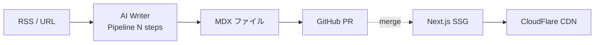

# プロジェクト概要

Revolution は、LLM (Claude / OpenAI / Gemini) を活用した **AI 記事生成パイプライン** と、生成された記事を **MDX ファイル** として GitHub に PR で投入し、Next.js の SSG で配信する Jamstack 構成の Web メディアシステムです。

## ビジョン

これまで手動で 1 万記事以上を作成してきた知見を、LLM とモジュール化された YAML テンプレートに落とし込み、**RSS / URL → N ステップのパイプライン → MDX → GitHub PR → 公開** までを自動化する。

## システム全体像

パイプラインの詳細ステップ構造は [`pipeline.md`](./pipeline.md) を参照。

## 構成要素

| 領域 | 役割 | 詳細 |
|---|---|---|
| **AI Writer** (`apps/ai-writer/`) | パイプライン本体。LLM 呼び出し / テンプレート展開 / Schema 検証 / MDX 生成 | [`pipeline.md`](./pipeline.md) |
| **Frontend** (`apps/frontend/`) | 公開 Web サイト (Next.js 16 SSG) | [`current-stack.md`](./current-stack.md) |
| **Templates** (別リポジトリ `revolution-templates`) | YAML テンプレート集。プロンプト + 出力スキーマ | (private) |
| **Cloud Run** | AI Writer のサーバーレス実行環境 + Cloud Scheduler 定期起動 | [`../operations/ai-writer-cloud-run.md`](../operations/ai-writer-cloud-run.md) |
| **GitHub** | MDX ソース管理 + PR ベース公開ワークフロー | — |

## 設計原則

- **Schema-SDD** (Schema-Driven Development): `shared/schemas/` の Zod スキーマが真実源。すべての入出力境界で検証
- **Layer 1 / Layer 2 / Layer 3 TDD**: contract test (Layer 1) と integration test (Layer 2) を MUST、E2E (Layer 3) はオプション
- **SoC** (Separation of Concerns): AI Writer (記事生成) と Frontend (表示) は責務分離。AI Writer は Frontend の知識を持たない

詳細: `@llm-context/development-principles.md` (gitignored、Claude セッション内で自動ロード)

## 利用者像

- **個人開発者** ([@thanks2music](https://github.com/thanks2music)): 知見を AI で省力化しつつ品質を担保
- **AI コラボレーター** (Claude Code / Codex / ChatGPT): スキーマと llm-context により迷わずコード変更
