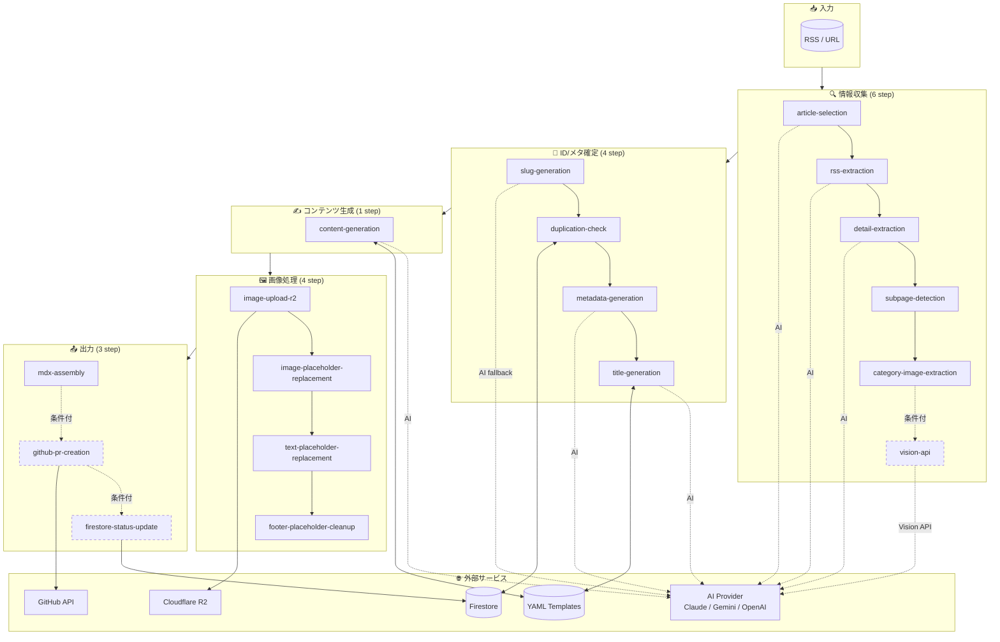
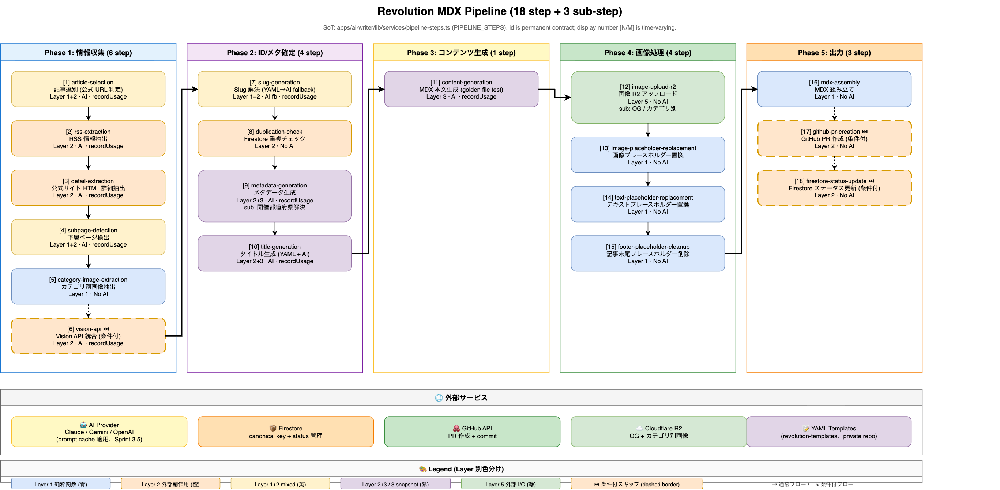
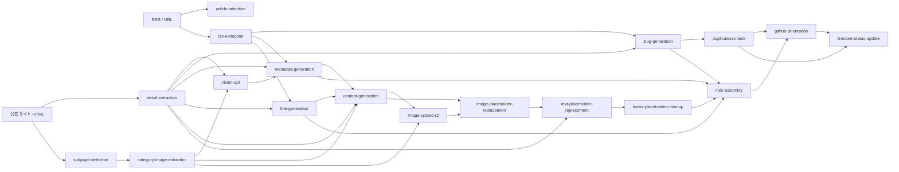

# Revolution MDX Pipeline

> Revolution の AI Writer (Discovery) が RSS / URL から MDX 記事を生成するマルチステップパイプラインの全体像と各ステップの責務を定義するドキュメント。
>
> **真実源 (SoT)**: `apps/ai-writer/lib/services/pipeline-steps.ts` の `PIPELINE_STEPS` 配列。
> **id は永続契約**、表示番号 (`[N/M]`) は配列長から動的算出され**中間挿入で変動**するため、過去ログとの突合は **id ベース**で行ってください。

## 目次

- [概要](#概要)
- [パイプラインフロー図 (Mermaid)](#パイプラインフロー図-mermaid)
- [パイプラインフロー図 (draw.io)](#パイプラインフロー図-drawio)
- [ステップ一覧 (18 step)](#ステップ一覧-18-step)
- [Sub-step (吸収済 3 件)](#sub-step-吸収済-3-件)
- [ステップ間の依存関係 (DAG)](#ステップ間の依存関係-dag)
- [Layer 別 TDD 戦略との対応](#layer-別-tdd-戦略との対応)
- [ステップ追加時の判定基準](#ステップ追加時の判定基準)
- [関連ドキュメント / SoT](#関連ドキュメント--sot)

---

## 概要

AI Writer は RSS / URL を入力として、**18 個の top-level step** + **3 個の sub-step (parent に吸収済)** を順次実行し、最終成果物として **MDX 記事ファイル + GitHub PR** を出力します。

主要フェーズ:

1. **情報収集** (article-selection → vision-api): RSS と公式サイト HTML から記事候補を選別 → 詳細情報抽出 → 必要に応じて Vision API で画像から補完
2. **ID/メタ確定** (slug-generation → title-generation): URL slug 解決 → Firestore 重複チェック → メタデータとタイトル生成
3. **コンテンツ生成** (content-generation): MDX 本文を AI で生成
4. **画像処理** (image-upload-r2 → footer-placeholder-cleanup): R2 アップロード + 各種プレースホルダー置換
5. **出力** (mdx-assembly → firestore-status-update): MDX 組み立て → GitHub PR 作成 → Firestore ステータス更新

### 設計上の重要原則

- **id は永続契約**: `'article-selection'` 等の semantic id は cost-tracker / ログ集計クエリ / 過去ログ突合のキー。renaming は破壊的変更
- **表示番号 `[N/M]` は時系列で変動**: `PIPELINE_STEPS` 配列の中間に新規 step を追加すると `[3/18]` が `[4/19]` に変わる。表示番号で過去ログを比較してはならない
- **prompt cache (Sprint 3.5、PR #221) で input cost ~50% 削減見込み**: Vision API は Anthropic prompt cache (5m TTL) を使用 (`vision-api` step 内部の最適化)
- **条件付スキップ step が 3 件**: `vision-api` (HTML 充足時)、`github-pr-creation` / `firestore-status-update` (dryRun / localOnly 時)

---

## パイプラインフロー図 (Mermaid)

実行順序を簡潔に表現します。条件付スキップは破線で表現。

---

## パイプラインフロー図 (draw.io)

draw.io 形式で「フェーズ別グルーピング + Layer 別色分け」を視覚化したバージョンです。Mermaid 図とは異なる切り口で同じ内容を補完します。

**source**: [`pipeline.drawio`](./pipeline.drawio) — 編集は [draw.io](https://app.diagrams.net/) または VS Code 拡張 (`hediet.vscode-drawio`) で行えます。**Mermaid 図と内容ズレを防ぐため、片方だけの更新は禁止**。両方とも `PIPELINE_STEPS` 配列の現状を反映してください。

---

## ステップ一覧 (18 step)

各 step の責務 / 依存 / Layer 割当 / cost-tracker 記録対象を一覧します。Mid level (実装 jsdoc + 真実源コード参照で詳細補完してください)。

### Phase 1: 情報収集

| # | id | 責務 | AI 呼出 | Layer | 依存 (上流) | 出力 (下流が使用) | 条件付スキップ | recordUsage |
|---|---|---|---|---|---|---|---|---|
| 1 | `article-selection` | RSS 記事から公式 URL 検出と「記事生成すべきか」の採用判定 | あり | Layer 1 (decisive) + Layer 2 (AI fallback) | RSS item, articleHtml | shouldGenerate, officialUrls | なし | あり |
| 2 | `rss-extraction` | RSS 本文から workTitle / storeName / eventTypeName を抽出 | あり | Layer 2 + Layer 3 (snapshot) | RSS item | extraction (workTitle, storeName, eventTypeName) | request.extracted 渡し時 | あり (有 usage 時) |
| 3 | `detail-extraction` | 公式サイト HTML から店舗名 / 開催期間 / 略称 / 開催回数等を詳細抽出 | あり | Layer 2 | officialHtml | detailedExtraction (multiple fields) | 失敗時はパイプライン中止 | あり |
| 4 | `subpage-detection` | 公式サイトから menu / novelty / goods 下層ページを検出 | あり (AI fallback) | Layer 1 (decisive) + Layer 2 (AI) | officialHtml, pageLinks | subpageDetection (URLs, methods) | officialHtml なし時 | あり (AI 使用時のみ) |
| 5 | `category-image-extraction` | 検出した下層ページからカテゴリ別画像 URL を抽出 | なし (HTML パース) | Layer 1 | subpageDetection | categoryImages (menu/novelty/goods URLs) | subpage-detection スキップ時自動 | なし |
| 6 | `vision-api` | 画像 + Templates v1.2 prompt で Claude/OpenAI Vision API を 3 カテゴリ並列呼出 (prompt cache 適用) | あり | Layer 2 (provider mock + contract) | categoryImages, htmlSufficiency | visionExtraction, fallbackLevel, hallucinationDetected | HTML 充足 / 画像なし / detailedExtraction なし時 | あり (有 usage 時) |

### Phase 2: ID/メタ確定

| # | id | 責務 | AI 呼出 | Layer | 依存 (上流) | 出力 (下流が使用) | 条件付スキップ | recordUsage |
|---|---|---|---|---|---|---|---|---|
| 7 | `slug-generation` | workSlug / storeSlug / eventTypeSlug / prefectureSlugs を YAML マッピング → AI フォールバック順で解決 | AI fallback | Layer 1 (YAML 部) + Layer 2 (AI 部) | extraction の各種名前, YAML config | workSlug, storeSlug, eventType, prefectureSlugs | YAML hit 時 AI 不要 | あり (slug-generator.ts) |
| 8 | `duplication-check` | canonical key で Firestore 重複検出 + GitHub PR 状態確認 + 必要に応じてイベント登録 | なし | Layer 2 (Firestore Admin SDK mock) | workSlug, storeSlug, eventType, year | isDuplicate, canonicalKey, eventRecord | dryRun / localOnly でスキップ表示 | なし |
| 9 | `metadata-generation` | カテゴリ・抜粋を AI で生成 + 開催都道府県を taxonomy.yaml で解決 | あり | Layer 2 + Layer 3 | extraction, detailedExtraction, taxonomy.yaml | categories, excerpt, prefectures | なし | あり |
| 10 | `title-generation` | YAML テンプレート + AI でタイトル生成 (期間・店舗名等を埋め込み) | あり | Layer 2 + Layer 3 (snapshot) | workTitle, eventTitle, detailedExtraction (期間など) | title, length, is_valid | なし | あり |

### Phase 3: コンテンツ生成

| # | id | 責務 | AI 呼出 | Layer | 依存 (上流) | 出力 (下流が使用) | 条件付スキップ | recordUsage |
|---|---|---|---|---|---|---|---|---|
| 11 | `content-generation` | YAML テンプレート + AI で MDX 本文を生成 | あり | Layer 3 (golden file) | metadata, title, detailedExtraction, categoryImages | content (MDX 本文), generatedSections | なし | あり |

### Phase 4: 画像処理

| # | id | 責務 | AI 呼出 | Layer | 依存 (上流) | 出力 (下流が使用) | 条件付スキップ | recordUsage |
|---|---|---|---|---|---|---|---|---|
| 12 | `image-upload-r2` | OG 画像 + カテゴリ別画像を Cloudflare R2 にアップロード | なし | Layer 5 (R2 統合) | content (OG URL), categoryImages | ogImageUpload, categoryR2Images | dryRun でスキップ | なし |
| 13 | `image-placeholder-replacement` | content 内の `{ここに...の画像を入れる}` プレースホルダーを R2 URL に置換 | なし | Layer 1 (純粋関数) | content, categoryR2Images | placeholderReplacement, unreplacedPlaceholders | R2 画像なし時スキップ | なし |
| 14 | `text-placeholder-replacement` | content 内の `{{店舗名}}` 等の Mustache placeholder を detailedExtraction で置換 | なし | Layer 1 | content, detailedExtraction | textPlaceholderReplacement | detailedExtraction なし時スキップ | なし |
| 15 | `footer-placeholder-cleanup` | Frontend で動的表示する記事末尾 placeholder を削除 (UI 責務との分離) | なし | Layer 1 | content | content (cleaned) | なし | なし |

### Phase 5: 出力

| # | id | 責務 | AI 呼出 | Layer | 依存 (上流) | 出力 (下流が使用) | 条件付スキップ | recordUsage |
|---|---|---|---|---|---|---|---|---|
| 16 | `mdx-assembly` | frontmatter + content を組み合わせて最終 MDX 文字列を生成 | なし | Layer 1 | post_id, title, slug, content, metadata 等 | mdxArticle | なし | なし |
| 17 | `github-pr-creation` | MDX を GitHub repo にコミットして PR 作成 | なし | Layer 2 (GitHub API mock) | mdxArticle, canonicalKey | prResult (prNumber, prUrl) | dryRun / localOnly でスキップ | なし |
| 18 | `firestore-status-update` | Firestore イベントの status を `pending → generated` に更新 | なし | Layer 2 (Firestore mock) | eventRecord, prResult | (副作用のみ) | dryRun / localOnly でスキップ | なし |

---

## Sub-step (吸収済 3 件)

「進捗単位として独立追跡が不要」と判定された短い順次処理は、parent step の sub-context として `[parent-id: sub-label]` 形式で吸収しています。判定基準は [ステップ追加時の判定基準](#ステップ追加時の判定基準) 参照。

| sub-label | 親 step | 役割 |
|---|---|---|
| `metadata-generation: 開催都道府県` | `metadata-generation` | taxonomy.yaml v1.1 areas 軸対応の都道府県解決ロジック (旧 `Step 4c`) |
| `image-upload-r2: OG` | `image-upload-r2` | content から抽出した OG URL を R2 アップロード (旧 `Step 5.5a`) |
| `image-upload-r2: カテゴリ別` | `image-upload-r2` | categoryImages の各 URL を R2 アップロード (旧 `Step 5.5b`) |

これらは log 上で `[image-upload-r2: OG] アップロード中...` のように表示されます (top-level step の `[12/18] 画像 R2 アップロード ...` の配下に出る形)。

---

## ステップ間の依存関係 (DAG)

実行順 (前述の Phase) と独立に、データフロー DAG を示します。同じ step 番号でも、実は前段の複数 step の出力に依存しているケースを可視化します。

---

## Layer 別 TDD 戦略との対応

`@llm-context/development-principles.md` (gitignored、ローカル参照) で定義された 5 層 TDD モデルへのマッピング (代表例、フル一覧は `PIPELINE_STEPS` 参照)。

| Layer | テスト手法 | 適用度 | 代表的な step |
|---|---|---|---|
| **Layer 1** 純粋関数 (決定的) | 古典的 TDD (Red→Green→Refactor) | **MUST** | `image-placeholder-replacement`, `text-placeholder-replacement`, `footer-placeholder-cleanup`, `mdx-assembly`, `pipeline-steps.ts` の `getStepIndex` 等 |
| **Layer 2** 外部副作用境界 | Mock + Contract test | **MUST** | `rss-extraction`, `vision-api`, `slug-generation` (AI fallback 部), `github-pr-creation`, `firestore-status-update` |
| **Layer 3** パイプライン段階 | Golden file / Snapshot test | SHOULD | `metadata-generation`, `content-generation`, `title-generation` |
| **Layer 4** AI 出力品質 | LLM-as-Judge / 抽出可能事実のみ assert | CAN | (未着手) |
| **Layer 5** Frontend SSG | Build-time check + Playwright E2E | SHOULD | (本パイプ外、`apps/frontend` 配下) |

**MUST**: Layer 1 + Layer 2 のテストは新規実装時に必須。Layer 3-5 は段階的適用 (`@llm-context/development-principles.md` § 層別 TDD 参照)。

---

## ステップ追加時の判定基準

新規処理を追加する際、**top-level step として `PIPELINE_STEPS` に追加**するか、**既存 step の sub-context として吸収**するかを以下の OR で判定します。

| 基準 | 適用対象 |
|---|---|
| (a) `recordUsage` を呼ぶ (cost-tracker への記録対象) | top-level step として独立 ID 付与 |
| (b) AI / 外部 API / 重い処理を伴い、独立して進捗ログを出したい | top-level step として独立 ID 付与 |
| (c) 親 step の内部で短い順次処理が走るだけ | **sub-context** として吸収。表示は `[parent-id: sub-label]` |

### 追加手順 (top-level の場合)

1. `apps/ai-writer/lib/services/pipeline-steps.ts` の `PIPELINE_STEPS` 配列に `{ id: 'new-step-id', label: '...' }` を追加 (位置は実行順序と一致させる)
2. `__tests__/unit/lib/services/pipeline-steps.test.ts` の "current 18-step lineup" smoke test に新 id を追記 (drift detector)
3. `recordUsage('new-step-id', model, usage)` を該当 service から呼び出す (型システムが新 id を受理)
4. `console.log(\`\${getStepDisplay('new-step-id')} ...\`)` で進捗ログ出力
5. 本ドキュメント (`pipeline.md`) のステップ一覧表に新 step を追記、図 (Mermaid + draw.io) も更新

### 追加手順 (sub-context の場合)

`PIPELINE_STEPS` には追加せず、parent step の log を `console.log(\`[\${getStepLabel('parent-id')}: sub-label] ...\`)` 形式で出力するのみ。本ドキュメントの「Sub-step (吸収済)」テーブルに追記。

---

## 関連ドキュメント / SoT

### コード SoT

- **`apps/ai-writer/lib/services/pipeline-steps.ts`**: `PIPELINE_STEPS` 配列 (id / label) と純粋関数 `getStepIndex` / `getStepLabel` / `getStepDisplay`
- **`apps/ai-writer/lib/services/article-generation-mdx.service.ts`**: メインのオーケストレーション (各 step の呼び出し順、`recordUsage` / `console.log` の発行)
- **`apps/ai-writer/lib/ai/cost/cost-tracker.service.ts`**: `recordUsage(step: PipelineStepId, ...)` の型強化箇所
- **`apps/ai-writer/__tests__/unit/lib/services/pipeline-steps.test.ts`**: Layer 1 contract test

### 関連サービス (各 step の実装)

| step id | 主要実装ファイル |
|---|---|
| article-selection | `lib/services/article-selection.service.ts` |
| rss-extraction | `lib/claude/rss-extractor.ts` (extractFromRss) |
| detail-extraction | `lib/services/extraction.service.ts` |
| subpage-detection | `lib/services/subpage-detector.service.ts` |
| category-image-extraction | `lib/services/category-image-extractor.service.ts` |
| vision-api | `lib/services/vision-api/{claude,openai}-vision.service.ts`, `multi-category-vision.service.ts` |
| slug-generation | `lib/config/slug-generator.ts`, `lib/config/slug-resolver.ts` |
| duplication-check | `lib/firestore/event-deduplication.ts` |
| metadata-generation | `lib/claude/metadata-generator.ts` |
| title-generation | `lib/services/title-generation.service.ts` |
| content-generation | `lib/services/content-generation.service.ts` |
| image-upload-r2 | `lib/services/og-image-upload.service.ts`, `article-image-upload.service.ts`, `r2-storage.service.ts` |
| image-placeholder-replacement | `lib/services/image-placeholder-replacer.service.ts` |
| text-placeholder-replacement | `lib/services/text-placeholder-replacer.service.ts` |
| footer-placeholder-cleanup | `lib/services/article-generation-mdx.service.ts` 内 |
| mdx-assembly | `lib/mdx/template-generator.ts` (generateMdxArticle) |
| github-pr-creation | `lib/github/create-mdx-pr.ts` |
| firestore-status-update | `lib/firestore/event-deduplication.ts` (updateEventStatus) |

### 開発原則 / 関連 PR

- **層別 TDD 戦略**: `@llm-context/development-principles.md` § 層別 TDD (gitignored、ローカル専用)
- **Schema-SDD**: `shared/schemas/` (zod 真実源、本パイプの `metadata.tokensUsed` 等で使用)
- **直近の機能拡張 PR**:
  - Sprint 3: [PR #214](https://github.com/thanks2music/revolution/pull/214) Vision API カテゴリ別抽出
  - Sprint 3.5: [PR #221](https://github.com/thanks2music/revolution/pull/221) Anthropic prompt cache (Vision API の Claude プロバイダで input cost ~50% 削減見込み)
  - 本ドキュメント: PR (本フィーチャー) で追加

### 別タスク

- **Templates YAML rename** ([Todoist `6gVmcmMcFXr4CCC8`](https://app.todoist.com/app/task/6gVmcmMcFXr4CCC8)): プライベート repo `revolution-templates` 側の `1.5-vision-extraction.yaml` 等の数値接頭辞ファイル名を semantic 化する別タスク
- **docs ディレクトリ全体リファクタ** ([Todoist `6gWVr3VgVQxWmhX8`](https://app.todoist.com/app/task/6gWVr3VgVQxWmhX8)): 旧 `docs/01-arch/` 等の連番ディレクトリを削除して flat 構造に再編する別タスク
